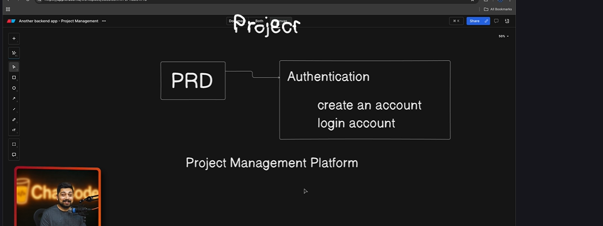

**A PRD (Product Requirements Document) is a master plan created by Product Managers. It outlines a product’s purpose, features, functionality, and behavior. It acts as a "single source of truth" to align designers, developers, and stakeholders on exactly what to build and why**

