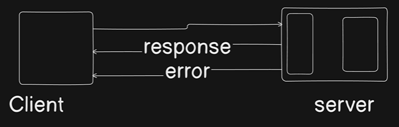

Now , the `error` is already managed by `Node` ecosystem by `Error` class

so we need to design the `response` part 

Now , go to the `utils` folder and create `api-response.js`

```js
class ApiResponse{
    constructor(statusCode , data , message = "success"){
        this.statusCode = statusCode
        this.data = data
        this.message = message
        this.success = statusCode < 400
    }
}

export {ApiResponse};
```

## For `errors`

go to `utils`  , create a file `api-error.js`

```js

class ApiError extends Error {
    constructor(statusCode , message = "Something went wrong",
        errors = [],
        stack = ""
    ){
        super(message)  // calling constructor of parent class
        this.statusCode = statusCode
        this.data = data
        this.message = message
        this.success = false;
        this.errors = errors

        if(stack){
            this.stack = stack
        }else{
            Error.captureStackTrace(this , this.constructor)
        }
    }
}

export {ApiError};
```
