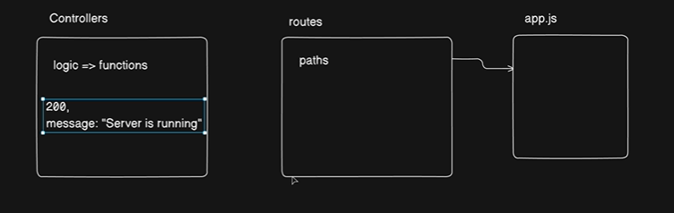
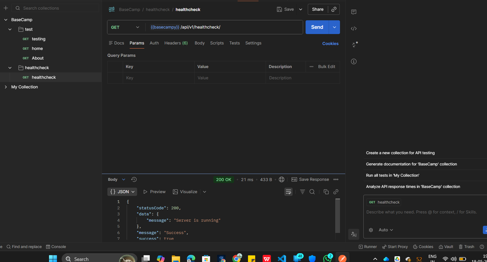

Inside `controllers` create a new file -> `healthcheck.controllers.js`


healthcheck.controllers.js ->

```js
import {ApiResponse} from "../utils/api-response.js"

const healthCheck = (req, res) => {
    try {
        res.status(200).json(
            new ApiResponse(200 , {message: "Server is running"})
        );
    } catch (error) {
        
    }
}

export {healthCheck};
```

Now , Work on the `routes`

create a file `healthcheck.routes.js` inside `routes`

```js
import { Router } from "express";
import { healthCheck } from "../controllers/healthcheck.controllers.js";

const router = Router();

router.route("/").get(healthCheck);


export default router;
```

after that , go to `app.js`

```js


// basic configurations

// cors configuration

// import the routes

import  healthCheckRouter  from "./routes/healthcheck.routes.js";

app.use("/api/v1/healthcheck" , healthCheckRouter);

```

Check -> 
