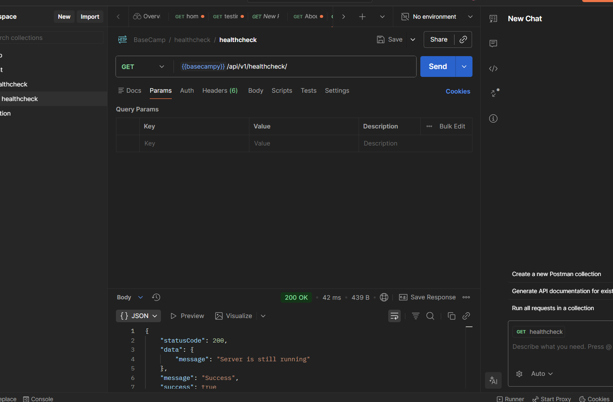

Go to `healthcheck.controllers.js` and write : 

```js
import {ApiResponse} from "../utils/api-response.js"

const healthCheck = async (req, res , next) => {
    try {
        const user = await getUserFromDB()

        res.status(200).json(
            new ApiResponse(200 , {message: "Server is running"})
        );
    } catch (error) {
        next(err)  // express's builtin error handler
    }
}

export {healthCheck};

```

now go inside `utils` , create `async-handler.js`

```js
// This is a higher order function (function as an input)

const asyncHandler = (requestHandler) => {
    return (req , res , next) => {
        Promise
        .resolve(requestHandler(req , res , next))
        .catch((err) => next(err))
    }
};

export { asyncHandler };

```

then comment out the previous `healthcheck.controller.js` and write this : 

```js
import { ApiResponse } from "../utils/api-response.js";
import { asyncHandler } from "../utils/async-handler.js";

// const healthCheck = async (req, res, next) => {
//   try {
//     const user = await getUserFromDB();

//     res
//       .status(200)
//       .json(new ApiResponse(200, { message: "Server is running" }));
//   } catch (error) {
//     next(err); // express's builtin error handler
//   }
// };

const healthCheck = asyncHandler(async (req, res) => {
  res.status(200).json(
    new ApiResponse(200, { message: "Server is running" })
    );
});

export { healthCheck };

```

so both versions are fine (commented one and the current one) , but we will prefer the 2nd version of it , also we don't need to write `next` as it is already included in the `async-handler`

> This is General , we can use in any project

Then , check it in `postman` 

