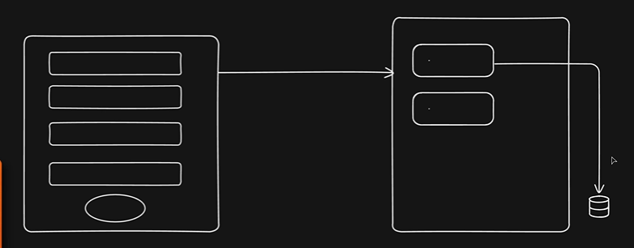
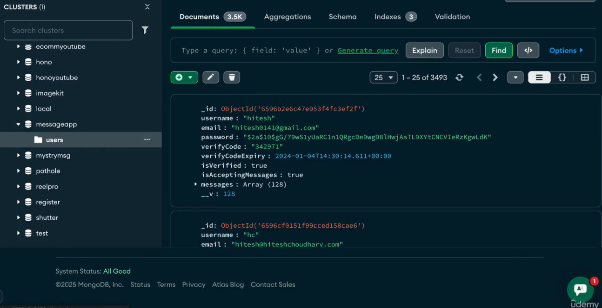
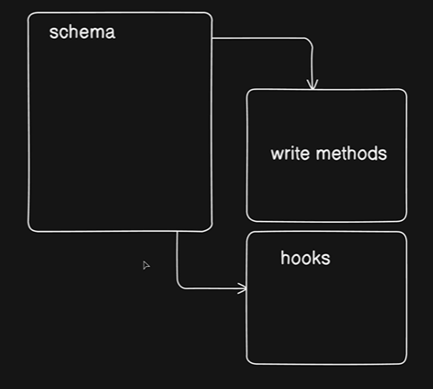

The journey of how to data travels from server to Database 



And this is how it looks like : 


Ok , so first of all 
-> Go to `models` folder : 

> `models` is a place where we keep the structure of the data like **username** , **email** , **password**

create a file `user.models.js`  and create a model

```js
import mongoose , {Schema} from "mongoose";

const userSchema = new Schema(
    {
        avatar: {
            type: {
                url: String,
                localPath: String,
            },
            default: {
                url: `https://placehold.co/250x250`,
                localPath: ""
            }
        },
        username: {
            type: String,
            required: true,
            unique: true,
            lowercase: true,
            trim: true,
            index: true,
        },
        email: {
            type: String,
            required: true,
            unique: true,
            lowercase: true,
            trim: true
        },
        fullName: {
            type: String,
            trim: true
        },
        password: {
            type: String,
            required: [true , "Password is required"] 
        },
        isEmailVerified: {
            type: Boolean,
            default: false
        },
        refreshToken: {
            type: String
        },
        forgotPasswordToken: {
            type: String
        },
        forgotPasswordExpiry: {
            type: Date
        },
        emailVerificationToken: {
            type: String
        },
        emailVerificationExpiry: {
            type: Date
        }
    },
    {
        timestamps: true,
    }
)

export const User = mongoose.model("User" , userSchema)

```

So, we have created a model for user: 


## Create a model for  user

