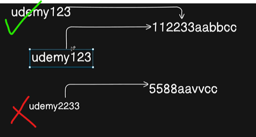

*So We usually write all of our methods in controller.*

*But there are certain methods which make sense to be attached within the scheme itself.*

*So things like in our case that somebody is saving the password in the encrypted format.*

*So how we are going to verify that the password you are entering in the clear text format is exactly same.*



*But this kind of mechanism, whether your password or same is not, should actually be a part of schema*

*itself rather than the controller logic.*

*And that's exactly what we'll be doing.*

*So we'll be writing a method for this.*

```js
// code ...


userSchema.methods.isPasswordCorrect = async function(password){
    return await bcrypt.compare(password , this.password)

    // password -> the method is carrying as a parameter
    // this.password -> from database
}

export const User = mongoose.model("User", userSchema);

```