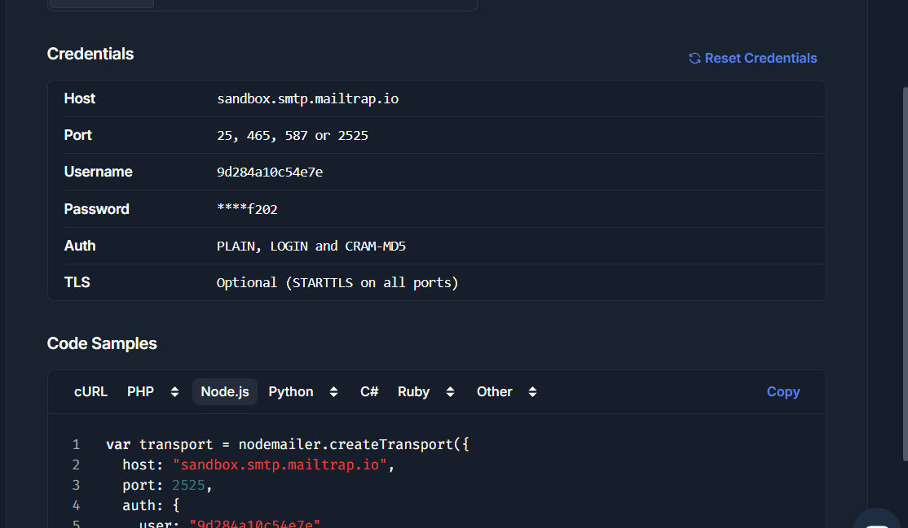
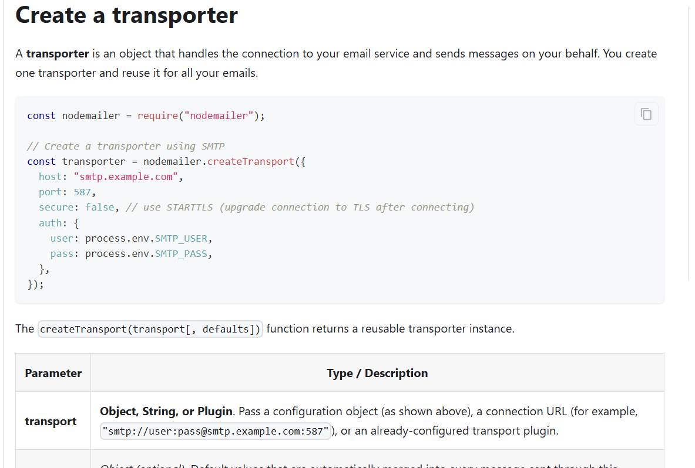

**Nodemailer Send emails from Node.js - easy as cake!**

*Nodemailer is the most popular email sending library for Node.js. It makes sending emails straightforward and secure, with zero runtime dependencies to manage.*

**Install with npm**

`npm install nodemailer`

---

Go to `.env` , and write :



```js
MAILTRAP_SMTP_HOST=sandbox.smtp.mailtrap.io
MAILTRAP_SMTP_PORT=2525
MAILTRAP_SMTP_USER=9d284a10c54e7e
MAILTRAP_SMTP_PASS=65eeab9e99f202
```

Now , first install Nodemailer :

`npm i nodemailer`



Code : 

```js

import Mailgen from "mailgen";

import nodemailer from "nodemailer";

const sendEmail = async (options) => {
    const mailGenerator = new Mailgen({
        theme: "default",
        product: {
            name: "Task Manager",
            link: "https://taskmanagerlink.com"
        }
    })

    const emailTextual = mailGenerator.generatePlaintext(options.mailgenContent)

    const emailHtml = mailGenerator.generate(options.mailgenContent)

    const transporter = nodemailer.createTransport({
        host: process.env.MAILTRAP_SMTP_HOST,
        port: process.env.MAILTRAP_SMTP_PORT,
        auth: {
            user: process.env.MAILTRAP_SMTP_USER,
            pass: process.env.MAILTRAP_SMTP_PASS,
        }
    })

    const mail = {
        from: "mail.taskmanager@example.com",
        to: options.email,  // recievers email
        subject: options.subject,
        text: emailTextual,
        html: emailHtml
    }

    try {
        await transporter.sendMail(mail)
    } catch (error) {
        console.error("Email service failed silently. Make sure that you have provided your Mailtrap credentials in the .env file")

        console.error("Error: " , error)
    }
}

const emailVerificationMailgenContent = (username, verificationUrl) => {
  return {
    body: {
      name: username,
      intro: "Welcome to our App! we'are excited to have you on board.",
      action: {
        instructions:
          "To verify your email , please click on the following button",
        button: {
          color: "#22BC66",
          text: "Verify your email",
          link: verificationUrl,
        },
      },
      outro:
        "Need help, or have questions? Just reply to this email, we\'d love to help.",
    },
  };
};

const forgotPasswordMailgenContent = (username, passwordResetUrl) => {
  return {
    body: {
      name: username,
      intro: "We got a request to reset the password of your account.",
      action: {
        instructions: "To reset your password click on the button or link",
        button: {
          color: "#22BC66",
          text: "Reset Password",
          link: passwordResetUrl,
        },
      },
      outro:
        "Need help, or have questions? Just reply to this email, we\'d love to help.",
    },
  };
};

export { emailVerificationMailgenContent, forgotPasswordMailgenContent , sendEmail};


```

# Final Summary : 

Today you learned:

```txt id="7m2x5q"
How backend applications actually SEND emails
```

This is a VERY important backend concept.

You already learned:

* token generation
* email template generation

Now you learned:

```txt id="1p8m4x"
how emails travel from backend → user inbox
```

---

# BIG PICTURE

Sending email has TWO major parts:

| Step                  | Purpose       |
| --------------------- | ------------- |
| Prepare Email Content | Design email  |
| Send Email            | Deliver email |

---

# Example Flow

```txt id="4q1m7x"
User registers
    ↓
Generate verification token
    ↓
Generate email template
    ↓
Send email
    ↓
User receives mail
```

---

# SERVICES MENTIONED

The lecture mentioned multiple services.

---

# 1. [Amazon SES (Simple Email Service)](https://aws.amazon.com/ses/?utm_source=chatgpt.com)

Production-grade email sending service by AWS.

Used for:

* scalable applications
* production apps
* millions of emails

---

## Example SMTP Config

```js id="6m2p9x"
const transporter = nodemailer.createTransport({
   host: "email-smtp.us-east-1.amazonaws.com",
   port: 587,
   auth: {
      user: process.env.AWS_SES_USER,
      pass: process.env.AWS_SES_PASS
   }
})
```

---

# 2. [Brevo (formerly Sendinblue)](https://www.brevo.com/?utm_source=chatgpt.com)

Another production email service.

Good for:

* startups
* transactional emails
* newsletters

---

## Example SMTP Config

```js id="2x8m5q"
const transporter = nodemailer.createTransport({
   host: "smtp-relay.brevo.com",
   port: 587,
   auth: {
      user: process.env.BREVO_USER,
      pass: process.env.BREVO_PASS
   }
})
```

---

# 3. [Mailtrap](https://mailtrap.io/?utm_source=chatgpt.com)

Used for:

```txt id="9m1x4q"
development/testing
```

Emails DO NOT go to real users.

Instead:

```txt id="5q2m8x"
you can inspect/test emails safely
```

Very commonly used during development.

---

## Example SMTP Config

```js id="7p4m1x"
const transporter = nodemailer.createTransport({
   host: process.env.MAILTRAP_SMTP_HOST,
   port: process.env.MAILTRAP_SMTP_PORT,
   auth: {
      user: process.env.MAILTRAP_SMTP_USER,
      pass: process.env.MAILTRAP_SMTP_PASS
   }
})
```

---

# 4. [Nodemailer](https://nodemailer.com/?utm_source=chatgpt.com)

MOST IMPORTANT library here.

Used for:

```txt id="3m8p2q"
actually sending emails in Node.js
```

---

# INSTALLATION

```bash id="8x2p5m"
npm install nodemailer
```

---

# WHAT YOUR CODE DOES

Your file now has TWO responsibilities:

| Part       | Purpose               |
| ---------- | --------------------- |
| Mailgen    | create email template |
| Nodemailer | send email            |

---

# IMPORTS

---

# Mailgen

```js id="1m7q4x"
import Mailgen from "mailgen";
```

Creates beautiful email content.

---

# Nodemailer

```js id="5m1x8q"
import nodemailer from "nodemailer";
```

Actually sends emails.

---

# sendEmail()

---

# Function

```js id="9x4m2p"
const sendEmail = async (options)
```

### Meaning

Reusable utility function for sending emails.

---

# options Object

This function expects:

```js id="4p7m1x"
{
   email,
   subject,
   mailgenContent
}
```

---

# MAILGEN INSTANCE

```js id="8m1q5x"
const mailGenerator = new Mailgen({
```

### Meaning

Creates Mailgen object.

---

# theme

```js id="2m8x4q"
theme: "default"
```

Email design style.

---

# product

```js id="6q1m7x"
product: {
   name: "Task Manager",
   link: "https://taskmanagerlink.com"
}
```

### Meaning

Default branding for emails.

Shown in footer/header.

---

# GENERATE PLAIN TEXT

```js id="1x5m9q"
mailGenerator.generatePlaintext()
```

### Meaning

Creates simple text version of email.

Used when:

```txt id="7m2p4x"
email client does NOT support HTML
```

---

# GENERATE HTML

```js id="3p8m1q"
mailGenerator.generate()
```

### Meaning

Creates beautiful HTML email.

---

# TRANSPORTER

MOST IMPORTANT PART.

---

# createTransport()

```js id="9q1m4x"
nodemailer.createTransport({
```

### Meaning

Creates email delivery connection.

Like:

```txt id="5m8p1x"
"vehicle for sending email"
```

---

# SMTP

You are using:

```txt id="2x7m4q"
SMTP protocol
```

(Simple Mail Transfer Protocol)

Used globally for email transfer.

---

# host

```js id="6m1x8q"
host: process.env.MAILTRAP_SMTP_HOST
```

Mail server address.

---

# port

```js id="1q8m5x"
port: process.env.MAILTRAP_SMTP_PORT
```

Communication port.

Usually:

* 587
* 2525

---

# auth

```js id="8p2m4x"
auth: {
   user,
   pass
}
```

### Meaning

SMTP login credentials.

---

# MAIL OBJECT

---

# from

```js id="4m9x1q"
from: "mail.taskmanager@example.com"
```

Sender email.

---

# to

```js id="7x1m5q"
to: options.email
```

Receiver email.

---

# subject

```js id="2p8m4x"
subject: options.subject
```

Email subject/title.

---

# text

```js id="5m2x9q"
text: emailTextual
```

Plain text email version.

---

# html

```js id="1x7m3q"
html: emailHtml
```

Styled HTML version.

---

# sendMail()

```js id="9m4p1x"
await transporter.sendMail(mail)
```

### Meaning

Actually sends email.

This is the FINAL delivery step.

---

# WHY try-catch?

Emails can fail because of:

* wrong credentials
* internet issues
* SMTP failure
* invalid email

So:

```js id="3q8m1x"
try {
   await transporter.sendMail(mail)
}
catch(error) {
```

handles failures safely.

---

# ENV VARIABLES

Very important.

---

# Why Use .env?

Never hardcode:

* passwords
* SMTP credentials
* secrets

Instead:

```env id="7m2x5p"
MAILTRAP_SMTP_HOST=
MAILTRAP_SMTP_PORT=
MAILTRAP_SMTP_USER=
MAILTRAP_SMTP_PASS=
```

---

# COMPLETE FLOW OF YOUR SYSTEM

---

# 1. User Registers

```txt id="1m8q4x"
POST /register
```

---

# 2. Backend Generates Verification Token

```js id="5x1m7q"
generateTemporaryToken()
```

---

# 3. Backend Creates Verification URL

```txt id="8m4p2x"
https://app.com/verify/token
```

---

# 4. Backend Generates Email Content

```js id="2q7m5x"
emailVerificationMailgenContent()
```

---

# 5. Backend Sends Email

```js id="6m2x1q"
sendEmail()
```

---

# 6. Mailtrap Receives Email

You inspect/test email.

---

# IMPORTANT ARCHITECTURE LESSON

Your backend now has clean separation:

| File          | Responsibility         |
| ------------- | ---------------------- |
| User Model    | generate tokens        |
| Mailgen Utils | create email templates |
| sendEmail()   | send emails            |
| Controllers   | connect everything     |

This is professional backend architecture.

---

# MOST IMPORTANT THING YOU LEARNED TODAY

You learned:

```txt id="9p4m1x"
Email Sending Pipeline
```

```txt id="4x8m2q"
Template
   ↓
SMTP Transport
   ↓
Mail Service
   ↓
User Inbox
```
