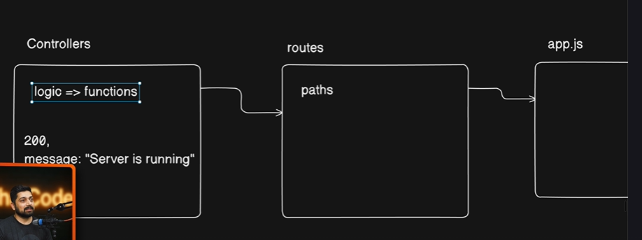

This is the approach we are following

=> We Write the controllers

=> We write the routes

=> Then integrate into app.js

So , go to `routes` , and create `auth.routes.js` :

```js
import { Router } from "express";
import { registerUser } from "../controllers/auth.controllers.js";

const router = Router();

router.route("/register").post(registerUser);

export default router;

```

### Common Rule 👉 
Whenever you create any new controller , come to `routes` folder and just write a new route for that controller 


now next step is go to `app.js`

```js

// import the routes

import authRouter from "./routes/auth.routes.js";

app.use("/api/v1/auth" , authRouter);
```

---
---

# Final Summary

You’ve now connected the three major backend layers together:

```text
Controller  →  Route  →  app.js
```

This is one of the MOST important architectures in Express.js backend development.

The image you shared is basically showing:

```text
Logic Layer        → Controllers
Path Layer         → Routes
Application Layer  → app.js
```

---

# Big Picture

Your backend is now behaving like this:

```text
Client Request
      ↓
app.js
      ↓
routes
      ↓
controller
      ↓
database / logic
      ↓
response
```

---

# Understanding the Architecture

# 1. Controllers → Logic

Controllers contain:

* business logic
* database operations
* token generation
* sending responses

Example:

```js
registerUser()
```

This function does:

* validate data
* create user
* generate token
* send email
* send response

So controller = actual functionality.

---

# 2. Routes → URL Mapping

Routes decide:

```text
Which URL should trigger which controller?
```

Example:

```js
router.route("/register").post(registerUser);
```

means:

```text
POST /register
→ call registerUser()
```

Routes DO NOT contain business logic.

They only connect:

```text
URL  → controller
```

---

# 3. app.js → Main Entry Point

`app.js` is where all routers are connected.

Example:

```js
app.use("/api/v1/auth", authRouter);
```

This means:

```text
Any request starting with:
/api/v1/auth
will use authRouter
```

---

# Full Flow of Your Registration API

Now let’s combine everything.

---

# STEP 1 — Frontend Sends Request

Example:

```http
POST /api/v1/auth/register
```

with body:

```json
{
  "email": "abc@gmail.com",
  "username": "prashant",
  "password": "123456"
}
```

---

# STEP 2 — app.js Receives It

```js
app.use("/api/v1/auth", authRouter);
```

Express sees:

```text
/api/v1/auth
```

and forwards request to:

```js
authRouter
```

---

# STEP 3 — auth.routes.js Handles Path

```js
router.route("/register").post(registerUser);
```

Now router checks remaining path:

```text
/register
```

and method:

```text
POST
```

If matched:

```js
registerUser()
```

gets executed.

---

# STEP 4 — Controller Executes

Now this runs:

```js
registerUser(req, res)
```

Inside it:

* checks DB
* creates user
* generates tokens
* sends email
* returns response

---

# Visual Flow

```text
POST /api/v1/auth/register
            ↓
app.js
            ↓
authRouter
            ↓
/register route
            ↓
registerUser controller
            ↓
MongoDB + Mail Service
            ↓
Response
```

---

# Understanding This Line

```js
router.route("/register").post(registerUser);
```

This is equivalent to:

```js
router.post("/register", registerUser);
```

Both are valid.

---

# Why `.route()` Exists

Because you can chain methods.

Example:

```js
router
   .route("/user")
   .get(getUser)
   .post(createUser)
   .put(updateUser)
   .delete(deleteUser);
```

Very clean syntax.

---

# Why Use Separate Route Files?

Imagine huge application:

```text
auth routes
user routes
admin routes
payment routes
course routes
chat routes
```

If everything is inside `app.js`:

```text
1000+ lines
```

It becomes impossible to manage.

So we modularize.

---

# Your Current Folder Structure

Probably something like:

```text
project/
│
├── controllers/
│   └── auth.controllers.js
│
├── routes/
│   └── auth.routes.js
│
├── models/
│   └── user.models.js
│
├── utils/
│
├── app.js
│
└── server.js
```

This is industry-standard structure.

---

# Understanding app.use()

This line:

```js
app.use("/api/v1/auth", authRouter);
```

mounts router.

Think of it like:

```text
Attach authRouter to this base URL
```

---

# VERY IMPORTANT CONCEPT

# Base URL + Route URL

---

## In app.js

```js
app.use("/api/v1/auth", authRouter);
```

Base URL:

```text
/api/v1/auth
```

---

## In auth.routes.js

```js
router.route("/register")
```

Child URL:

```text
/register
```

---

# Final URL

Express combines both:

```text
/api/v1/auth/register
```

---

# Why API Versioning?

```text
/api/v1/
```

This is API versioning.

Later if API changes:

```text
/api/v2/
/api/v3/
```

Old frontend apps still continue working.

This is heavily used in production.

---

# Why POST Request?

Registration changes database.

So REST convention says:

| Method | Purpose |
| ------ | ------- |
| GET    | Fetch   |
| POST   | Create  |
| PUT    | Replace |
| PATCH  | Update  |
| DELETE | Remove  |

Registration creates new user.

So:

```text
POST
```

is correct.

---

# Important Express Concepts You Learned

# 1. Router

```js
const router = Router();
```

Creates mini Express application.

---

# 2. Route Mounting

```js
app.use()
```

Connects routers to app.

---

# 3. Route Chaining

```js
router.route()
```

Clean multiple-method syntax.

---

# 4. Separation of Concerns

| Layer      | Responsibility      |
| ---------- | ------------------- |
| Controller | Logic               |
| Route      | URL mapping         |
| app.js     | Integrating routers |

This is the MOST important backend architecture principle.

---

# Your Current Registration Endpoint

Your final API is:

```http
POST /api/v1/auth/register
```

---

# Example Postman Request

## URL

```text
http://localhost:8000/api/v1/auth/register
```

---

## Method

```text
POST
```

---

## Body (JSON)

```json
{
  "email": "test@gmail.com",
  "username": "prashant",
  "password": "123456"
}
```

---

# Expected Flow Internally

```text
Request arrives
↓
authRouter activated
↓
registerUser called
↓
user saved in MongoDB
↓
verification token generated
↓
email sent
↓
response returned
```

---

# Expected Response

```json
{
  "statusCode": 200,
  "data": {
    "user": {
      "_id": "...",
      "email": "test@gmail.com",
      "username": "prashant"
    }
  },
  "message": "User registered successfully and verification email has been sent on your email"
}
```

---

# One Important Design Philosophy

Notice this carefully:

## app.js does NOT know registration logic

It only knows:

```text
"If request comes here,
send it to authRouter"
```

---

## Route does NOT know DB logic

It only knows:

```text
"If URL is /register,
call registerUser"
```

---

## Controller handles actual work

This separation makes code:

* scalable
* testable
* maintainable
* reusable

This is exactly how large Node.js backends are structured.
