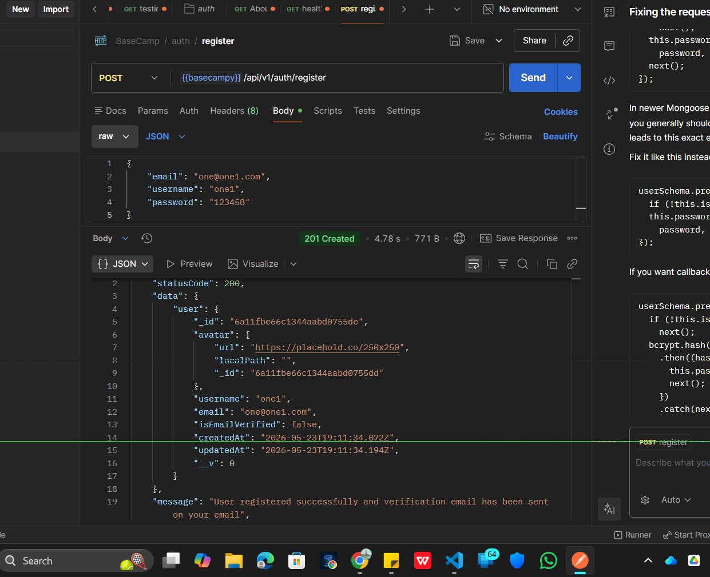
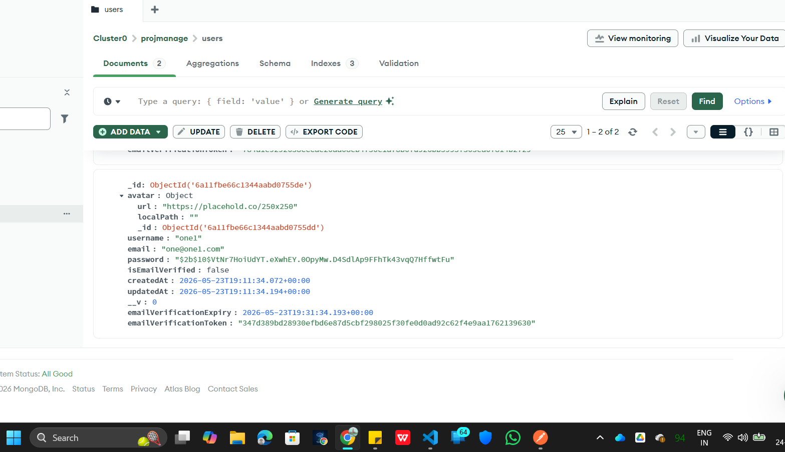

# Big Picture Flow

This is the full registration workflow:

```text
Client sends request
        ↓
Route receives request
        ↓
Controller runs business logic
        ↓
Validate user data
        ↓
Check DB for existing user
        ↓
Create user
        ↓
Generate verification token
        ↓
Store hashed token in DB
        ↓
Send verification email
        ↓
Return safe response
```

---

# Architecture Flow

Your diagram is extremely important:

```text
Frontend Request
       ↓
ROUTES
       ↓
CONTROLLERS
       ↓
MODELS / DB
       ↓
UTILS / SERVICES
       ↓
Response
```

---

# 1. Routes

Routes only define:

> “Which URL should call which controller?”

Example:

```js
router.route("/register").post(registerUser);
```

Meaning:

```text
POST /register
        ↓
run registerUser controller
```

Routes should stay very thin.

No business logic here.

---

# 2. Controllers

Controllers contain:

* authentication logic
* database operations
* calling utilities
* generating tokens
* sending responses

Example:

```js
const registerUser = asyncHandler(async (req, res) => {

})
```

This is the brain of the request.

---

# 3. app.js

This connects route groups to your application.

```js
app.use("/api/v1/auth", authRouter);
```

Meaning:

```text
Anything starting with:

/api/v1/auth

will use authRouter
```

So:

```text
/api/v1/auth/register
```

becomes:

```text
authRouter → /register route
```

---

# FINAL URL FLOW

Your request:

```text
POST /api/v1/auth/register
```

Flow:

```text
app.js
↓
authRouter
↓
/register route
↓
registerUser controller
↓
database + email + tokens
↓
response
```

---

# Understanding registerUser Step-by-Step

---

# STEP 1 — Receive Data

```js
const { email, username, password, role } = req.body;
```

This extracts JSON data from Postman/frontend.

Example request body:

```json
{
  "email": "one@one1.com",
  "username": "one1",
  "password": "123456"
}
```

---

# STEP 2 — Check Existing User

```js
const existedUser = await User.findOne({
  $or: [{ username }, { email }],
});
```

This checks:

```text
Does any user already have:
- this username
OR
- this email
```

---

# MongoDB $or Query

```js
{
  $or: [
    { username },
    { email }
  ]
}
```

Equivalent SQL idea:

```sql
WHERE username = ? OR email = ?
```

---

# STEP 3 — Throw Error if User Exists

```js
if (existedUser) {
  throw new ApiError(409, "User already exists");
}
```

409 means:

```text
Conflict
```

Because duplicate user already exists.

---

# STEP 4 — Create User

```js
const user = await User.create({
  email,
  password,
  username,
  isEmailVerified: false,
});
```

This inserts a new MongoDB document.

---

# Important Thing Happening Here

Your password is NOT stored directly.

Because your schema middleware probably contains:

```js
userSchema.pre("save", async function(next) {
    this.password = bcrypt.hash(...)
})
```

So before save:

```text
123456
```

becomes:

```text
$2b$10$....
```

That’s password hashing.

---

# STEP 5 — Generate Verification Token

```js
const {
  unHashedToken,
  hashedToken,
  tokenExpiry
} = user.generateTemporaryToken();
```

This creates:

| Token Type    | Purpose      |
| ------------- | ------------ |
| unHashedToken | sent to user |
| hashedToken   | stored in DB |
| tokenExpiry   | expiry time  |

---

# Why TWO Tokens?

This is VERY important security.

You NEVER store raw token in DB.

Instead:

```text
Raw token → sent to user
Hashed token → stored in DB
```

Later:

```text
User clicks link
↓
Server hashes incoming token
↓
Compares with DB hash
```

Exactly like passwords.

---

# STEP 6 — Save Verification Data

```js
user.emailVerificationToken = hashedToken;
user.emailVerificationExpiry = tokenExpiry;

await user.save({
  validateBeforeSave: false
});
```

This stores verification info in MongoDB.

---

# validateBeforeSave: false

Normally Mongoose runs validations again.

But here:

```text
You already trust this data
```

So validations are skipped for performance.

---

# STEP 7 — Send Verification Email

```js
await sendEmail({
    email: user.email,
    subject: "Please verify your email",
    mailgenContent: ...
})
```

This calls your reusable email utility.

---

# Dynamic Verification URL

This is VERY important:

```js
`${req.protocol}://${req.get("host")}/api/v1/users/verify-email/${unHashedToken}`
```

Suppose:

```text
req.protocol = http
req.get("host") = localhost:8000
```

Final URL becomes:

```text
http://localhost:8000/api/v1/users/verify-email/abc123token
```

---

# Understanding req.get("host")

Gets:

```text
localhost:8000
```

or:

```text
myapp.com
```

depending on environment.

This makes URLs dynamic.

Very production-friendly.

---

# STEP 8 — Remove Sensitive Fields

VERY important.

You NEVER send this:

* password
* refreshToken
* verificationToken

to frontend.

So:

```js
.select(
 "-password -refreshToken -emailVerificationToken"
)
```

removes them.

---

# Why Re-fetch User?

```js
const createdUser = await User.findById(...)
```

Because:

* cleaner object
* remove fields safely
* verify DB save worked

---

# STEP 9 — Send Final Response

```js
return res.status(201).json(
    new ApiResponse(...)
)
```

201 means:

```text
Resource Created
```

Correct REST status code.

---

# Your Postman Test

Your screenshots show everything worked correctly.

---

# What Happened Internally

When you clicked SEND:

```text
POSTMAN
↓
Express Route
↓
Controller
↓
MongoDB User Create
↓
Password Hashing
↓
Token Generation
↓
DB Save
↓
Mailtrap Email Send
↓
API Response
```

---

# Why Mailtrap is Used

Because during development:

* you don't want real emails
* you want email testing
* you want preview UI

So Mailtrap acts like a fake inbox.

---

# Why Email Verification Exists

Without verification:

Anyone could register using:

```text
fake@gmail.com
```

Verification ensures:

```text
User actually owns email
```

---

# Why This is Production-Level Code

Because you implemented:

✅ password hashing
✅ token generation
✅ token expiry
✅ email verification
✅ async error handling
✅ reusable utilities
✅ modular routes
✅ modular controllers
✅ reusable response classes
✅ environment variables
✅ security practices
✅ field sanitization

This is how real backend authentication systems are structured.

---

# One Important Thing You Noticed

In MongoDB:

```text
emailVerificationToken
```

is HASHED.

But in email:

```text
raw token
```

is sent.

This is correct.

---

# The Verification Flow Later

Later you'll build:

```text
GET /verify-email/:token
```

Flow:

```text
User clicks email link
↓
Server gets token
↓
Hashes token
↓
Finds matching hash in DB
↓
Checks expiry
↓
Marks user verified
```

---

# Small Improvement

In your controller:

```js
const { email, username, password, role } = req.body;
```

But role is unused.

Either:

* remove it
  OR
* actually save it

Otherwise unnecessary input exists.

---

# One More Important Backend Concept

You are now seeing why backend takes time.

Because real apps require:

* utilities
* services
* security
* validation
* reusable architecture
* modularity
* scalability

Toy apps skip all this.

Production apps cannot.

---

# Mental Model You Should Remember

```text
Routes
→ decide WHERE request goes

Controllers
→ decide WHAT happens

Models
→ talk to DB

Utils/Services
→ reusable functionality
```

This separation is one of the most important backend engineering concepts.
