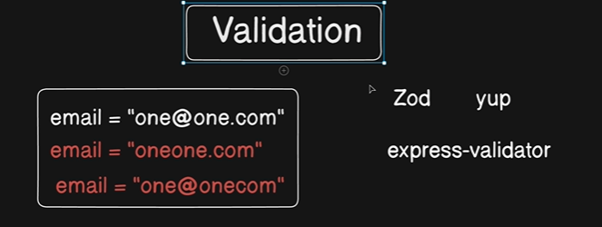
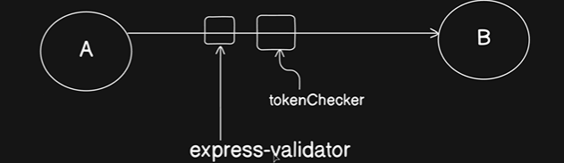
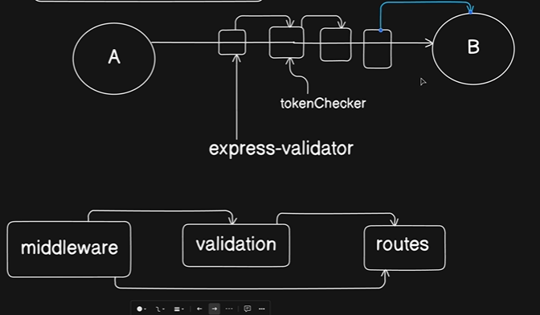

*Validation in Express is the process of checking incoming request data (from forms, query parameters, or request bodies) to ensure it meets specific rules before your server processes it. It is a critical step for maintaining data integrity, preventing security vulnerabilities (like SQL injection or malicious payloads), and avoiding application crashes.*



### MiddleWares : 




*The middleware exists so that you can just calculate all these errors and pass it on so that somebody*

*can actually get all the errors.*

*So that's the first part of it.*

*The second part is the validations itself.*

*Like what validation you want to work on with.*

*And the third part is their implementation in the routes file itself.*

*So these are the three things we are going to work on.*

## Actual Plan :

* First we are going to write a middleware.

* Then we are going to write a validation.

* And then we are going to implement that in the route.

That's the game plan.

So , Now go to `middlewares` folder 

Install : `npm i express-validator`

create a file `validator.middleware.js` : 

```js
import { validationResult } from "express-validator";
import { ApiError } from "../utils/api-error.js";

// logic : i will give you a file , you will extract some errors from it and process them

export const validate = (req , res , next) => {
    const errors = validationResult(req)

    if(errors.isEmpty()){
        return next();
    }

    const extractedErrors = []
    errors.array().map((err) => extractedErrors.push(
        {
            [err.path] : err.msg
        }
    ));

    throw new ApiError(422  , "Received Data is not valid" , extractedErrors)

}
```

Now the middleWare Part is completed, Move to `validation`

Now if you remember in our postman the data actually comes from a variety of places body auth headers

Most of the data as of now is coming up from the body itself, so we'll worry just about the body itself.

So for this we have this validators.

create a `new file` into this : `index.js`(inside `validators`) just one file

```js

import { body } from "express-validator";

const userRegisterValidator = () => {
  return [
    body("email") // this is how we extract the fields
      .trim()
      .notEmpty()
      .withMessage("Email is required") // if there is an error in just above method
      .isEmail()
      .withMessage("Email is Invalid"), // to check if email is valid

    body("username")
      .trim()
      .notEmpty()
      .withMessage("Username is required")
      .isLowercase()
      .withMessage("Username must be in lowercase")
      .isLength({ min: 3 })
      .withMessage("Username must be at least three characters long"),

    body("password").trim().notEmpty().withMessage("Password is required"),

    body("fullName").optional().trim(),
  ];
};

export { userRegisterValidator };

```

now , validation part also done


Lets handle the route : 

do to `routes` , open `auth.routes.js` then write :




## Final Summary

You’ve now reached one of the most important backend concepts: **middleware + validation flow** in Express.

Your current architecture is actually very close to how production backend APIs are structured.

Here’s the complete flow of what happens now when a user hits:

```txt
POST /api/v1/auth/register
```

---

# Complete Flow

```txt
Client Request
      |
      v
auth.routes.js
      |
      |--> userRegisterValidator()
      |        |
      |        --> Collect validation errors
      |
      |--> validate middleware
      |        |
      |        --> If errors exist:
      |                 throw ApiError(422)
      |
      |        --> Else:
      |                 next()
      |
      |--> registerUser controller
               |
               --> DB operations
               --> create user
               --> send email
               --> send response
```

---

# Why Middleware Exists

Middleware means:

> “Run something in between request and response”

Express internally works like a chain.

```txt
req ---> middleware1 ---> middleware2 ---> controller ---> response
```

Your route:

```js
router.route("/register").post(
    userRegisterValidator(),
    validate,
    registerUser
)
```

means:

```txt
1. Run validators
2. Run validate middleware
3. If valid → run controller
```

---

# Very Important Concept

## This:

```js
userRegisterValidator()
```

IS A FUNCTION CALL

because it RETURNS an array of validators.

---

## But this:

```js
validate
```

is NOT called manually.

Express itself calls middleware automatically.

That’s why we pass reference only:

```js
validate
```

NOT:

```js
validate()
```

---

# What `userRegisterValidator()` Actually Returns

This function:

```js
const userRegisterValidator = () => {
    return [
        body("email").isEmail(),
        body("username").notEmpty(),
    ];
};
```

returns:

```js
[
   middleware1,
   middleware2
]
```

Each validator itself is a middleware internally.

So this:

```js
userRegisterValidator()
```

actually becomes:

```js
[
   emailValidatorMiddleware,
   usernameValidatorMiddleware
]
```

Express runs them one by one.

---

# What `validationResult(req)` Does

This line:

```js
const errors = validationResult(req)
```

extracts all validation errors collected by previous validators.

Example:

If request body is:

```json
{
   "email": "abc",
   "username": ""
}
```

then errors internally become something like:

```js
[
   {
      path: "email",
      msg: "Email is Invalid"
   },
   {
      path: "username",
      msg: "Username is required"
   }
]
```

---

# Why `next()` Is Important

This line:

```js
return next();
```

means:

> “Validation successful. Continue request flow.”

Without `next()`:

the request gets stuck forever.

---

# This is Extremely Important

```js
throw new ApiError(...)
```

inside middleware automatically skips remaining middlewares/controllers and goes to Express error handler.

So this never executes if validation fails:

```js
registerUser
```

---

# Your Validator Logic

This part:

```js
body("email")
```

means:

```txt
Take email field from req.body
```

---

## `.trim()`

```js
.trim()
```

removes spaces.

Example:

```txt
"   hello@gmail.com   "
```

becomes:

```txt
"hello@gmail.com"
```

---

## `.notEmpty()`

Checks:

```txt
""  ❌
null ❌
undefined ❌
```

---

## `.withMessage()`

Custom error message for previous validator.

```js
.notEmpty()
.withMessage("Email is required")
```

---

## `.isEmail()`

Checks email format.

Examples:

Valid:

```txt
abc@gmail.com
```

Invalid:

```txt
abc
abc@
abc.com
```

---

# Why Your Validation Architecture Is Good

Because now every feature becomes modular.

Later you can easily create:

```txt
validators/
    login.validator.js
    reset-password.validator.js
    project.validator.js
```

and reuse:

```js
validate
```

everywhere.

---

# Real Production Pattern

Most large Express apps follow this structure:

```txt
routes/
controllers/
middlewares/
validators/
models/
utils/
```

Exactly what you’re building now.

---

# One Small Improvement

Instead of:

```js
errors.array().map(...)
```

prefer:

```js
errors.array().forEach(...)
```

because you are not transforming array data.

You are only looping.

Better version:

```js
errors.array().forEach((err) => {
    extractedErrors.push({
        [err.path]: err.msg
    });
});
```

---

# Another Improvement You Can Add Later

For password:

```js
.isLength({ min: 8 })
.withMessage("Password must be at least 8 characters long")
```

You can also add:

```js
.matches(/[A-Z]/)
.matches(/[0-9]/)
.matches(/[!@#$%^&*]/)
```

for stronger passwords.

---

# Most Important Thing You Learned Here

Backend request handling is not:

```txt
Request -> Controller
```

Production flow is:

```txt
Request
   -> Middleware
   -> Validation
   -> Authentication
   -> Authorization
   -> Controller
   -> Response
```

This middleware pipeline is the foundation of modern backend systems.
