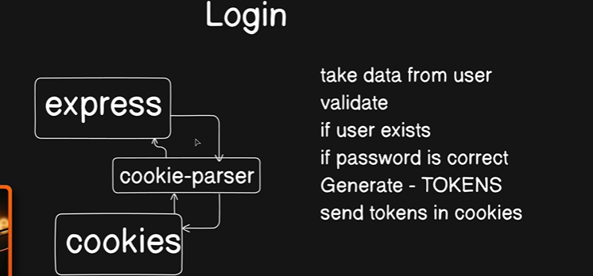
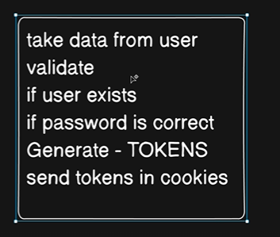

Now , lets learn about Login Feature : 



Based on the text and diagram provided, here is the summary of the login flow and cookie handling:

* Login Sequence: The server takes user data, validates it, checks if the user exists, verifies the password, generates tokens, and sends them back to the client.

* Web vs. Mobile: Mobile apps handle tokens directly, whereas web applications standardly store these authentication tokens inside browser cookies for security.

* The Express Limitation: Express does not have built-in, direct access to read or write browser cookies on its own.

* The Cookie-Parser Bridge: The `cookie-parser` package acts as a vital middleware bridge that connects Express to the browser cookies, enabling the application to easily parse and manage them.

---


## Install : `npm i cookie-parser`

Now Go to `app.js` , and write : 

```js

import cookieParser from "cookie-parser";

// Cookie parser
app.use(cookieParser()) //+ Now we have access to cookies
```


Next is , write controller for  login , for login we are going to do all this : 



So , go inside the file `auth.controllers.js` and write following methods : 

```js

//* Very much similar to registerUser
const login = asyncHandler(async (req , res) => {
    // the user can login with email or password or both

    //~ Step1 => Take user data
    const {email , password , username} = req.body;

    if(!email){
        throw new ApiError(400 , "email is required")
    }

    //~ step2 => Validate
    // This will be done later

    //~ step3 => check if the user exists
    const user = await User.findOne({email});

    if(!user){
        throw new ApiError(400 , "User does not exists");
    }

    //~ step4 => Check the password
    // this method we already written before .isPasswordCorrect()
    const isPasswordValid =  await user.isPasswordCorrect(password);

    if(!isPasswordValid){
        throw new ApiError(400 , "Invalid Credentials");
    }

    //~ step5 => Generate All Tokens
    const {accessToken , refreshToken} = await generateAccessAndRefreshTokens(user._id);

    //~ Send tokens in cookies

    const loggedInUser = await User.findById(user._id).select(
        "-password -refreshToken -emailVerificationToken -emailVerificationExpiry",
    );

    // for cookies
    const options = {
        httpOnly: true,
        secure: true
    }

    return res
            .status(200)
            .cookie("accessToken" , accessToken , options)
            .cookie("refreshToken" , refreshToken , options)
            .json(
                new ApiResponse(
                    200,
                    {
                        user: loggedInUser,
                        accessToken,
                        refreshToken
                    },
                    "User logged in successfully"
                )
            )

})

export { registerUser , login};
```

Now , we have to set the route => 

Go to `auth.routes.js` : 

```js
import { login } from "../controllers/auth.controllers.js";

router.route("/login").post(login);
```
**Now All we have to do is , write Controller add to router write controller add to router and maybe in between we have to validate as well**

---
---

## Final Summary

You’ve now reached the stage where the backend structure starts feeling “real”.
Most production Express backends follow this same flow:

```text
Controller  ->  Route  ->  Middleware  ->  Database
```

And now you’ve added:

```text
Validation
Authentication
Cookies
Tokens
```

So your backend architecture is becoming production-style.

---

# Big Picture of Your Login Flow

Your login system now works like this:

```text
Client sends:
POST /api/v1/auth/login

        │
        ▼

Route receives request
        │
        ▼

Controller executes
        │
        ▼

1. Extract email/password
2. Validate input
3. Find user in DB
4. Compare password
5. Generate tokens
6. Save refresh token
7. Send cookies
8. Send response
```

---

# Your Current Login Controller (Explained Properly)

---

## STEP 1 → Extract Data

```js
const {email , password , username} = req.body;
```

Frontend sends:

```json
{
  "email": "abc@gmail.com",
  "password": "123456"
}
```

Express stores this inside:

```js
req.body
```

So you extract it.

---

# STEP 2 → Basic Validation

```js
if(!email){
    throw new ApiError(400 , "email is required")
}
```

This prevents empty login requests.

Later you’ll move this into validator middleware.

---

# STEP 3 → Find User

```js
const user = await User.findOne({email});
```

MongoDB query:

```js
db.users.findOne({ email: "abc@gmail.com" })
```

If user doesn’t exist:

```js
throw new ApiError(400 , "User does not exists");
```

---

# STEP 4 → Verify Password

This is the important security part.

```js
const isPasswordValid =
    await user.isPasswordCorrect(password);
```

Remember:

Database stores:

```text
hashed password
```

NOT actual password.

So:

```text
Entered Password
      ↓
bcrypt.compare()
      ↓
Compare with hashed password
```

Inside model:

```js
userSchema.methods.isPasswordCorrect =
async function(password){
    return await bcrypt.compare(password, this.password)
}
```

---

# STEP 5 → Generate Tokens

```js
const {accessToken , refreshToken}
      = await generateAccessAndRefreshTokens(user._id);
```

Usually:

---

## Access Token

Short life.

Example:

```text
15 minutes
```

Used for authentication.

---

## Refresh Token

Long life.

Example:

```text
7 days
```

Used to generate new access token.

---

# Why Two Tokens?

Because:

```text
Access token expires quickly
```

for security.

But user should not login repeatedly.

So refresh token helps generate new access token silently.

---

# STEP 6 → Remove Sensitive Fields

Very important.

You NEVER send:

```text
password
refreshToken
verificationToken
```

to frontend.

So:

```js
.select(
 "-password -refreshToken ..."
)
```

removes them.

---

# STEP 7 → Cookies

This is the new part you learned.

---

# Why cookie-parser?

Express cannot directly read/write cookies properly.

So:

```bash
npm install cookie-parser
```

Then:

```js
app.use(cookieParser())
```

This adds cookie support to Express.

---

# Cookie Flow

```text
Browser
   ▲
   │ cookies
   ▼
Express Server
```

cookie-parser acts like translator.

---

# Setting Cookies

```js
.cookie("accessToken", accessToken, options)
```

This tells browser:

```text
Store this token safely
```

Browser automatically stores it.

---

# Cookie Options

```js
const options = {
    httpOnly: true,
    secure: true
}
```

---

## httpOnly

```text
JavaScript cannot access cookie
```

Protects against XSS attacks.

Very important.

---

## secure

```text
Cookie only sent over HTTPS
```

In development sometimes you use:

```js
secure: false
```

because localhost often uses HTTP.

---

# Final Response

```js
.json(
   new ApiResponse(...)
)
```

You send:

```js
{
   user,
   accessToken,
   refreshToken
}
```

along with cookies.

---

# VERY IMPORTANT CONCEPT

You are BOTH:

---

## Setting Cookies

```js
.cookie(...)
```

AND

---

## Sending JSON Response

```js
.json(...)
```

Both happen together in one response.

---

# Complete Request Lifecycle

```text
POST /login
      │
      ▼
Route
      │
      ▼
Middleware (optional)
      │
      ▼
Controller
      │
      ▼
Find user
      │
      ▼
Check password
      │
      ▼
Generate tokens
      │
      ▼
Set cookies
      │
      ▼
Send response
```

---

# Why This Architecture Is Good

Because now:

---

## Adding New Features Becomes Easy

For example:

```text
login
logout
change-password
forgot-password
reset-password
refresh-token
verify-email
```

All follow SAME pattern.

You only write:

```text
Controller + Route + Validation
```

That’s why backend frameworks feel easier after initial setup.

---

# One Small Improvement For Your Login Route

Right now:

```js
router.route("/login").post(login);
```

But ideally you should validate login too.

Example:

```js
router.route("/login").post(
    userLoginValidator(),
    validate,
    login
);
```

Production apps ALWAYS validate login data.

---

# One Important Development Note

This:

```js
secure: true
```

may fail on localhost sometimes.

During development many people use:

```js
const options = {
    httpOnly: true,
    secure: process.env.NODE_ENV === "production"
}
```

So:

* Development → HTTP allowed
* Production → HTTPS only

---

# The Biggest Concept You Learned Here

This is the real achievement:

```text
Authentication Flow
```

Most beginner backend projects stop at CRUD.

But authentication teaches:

* hashing
* cookies
* middleware
* tokens
* validation
* security
* database lookup
* async flow
* response handling

This is the foundation of real backend development.
