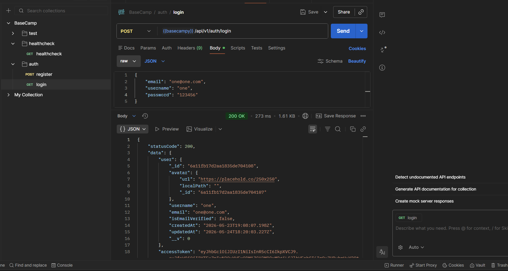
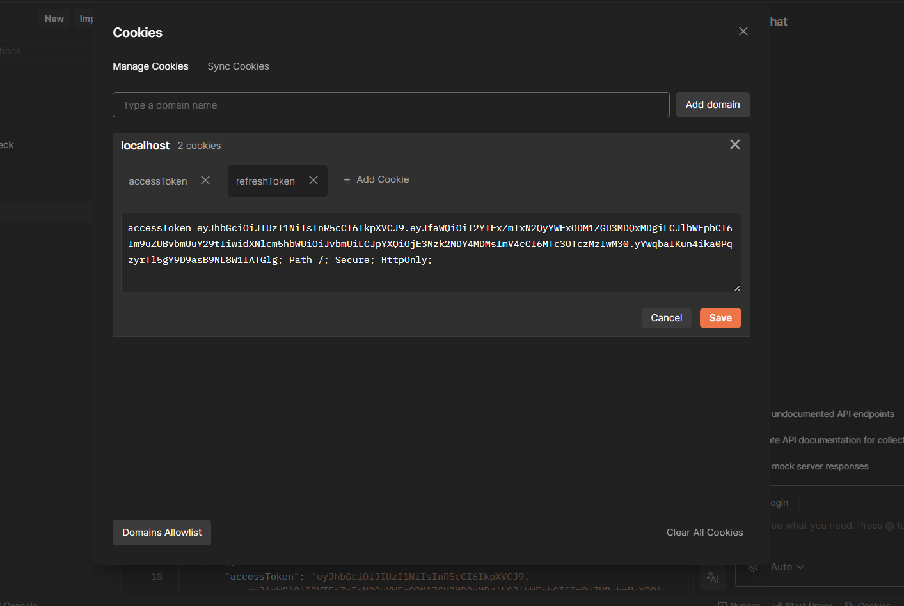

Let's write validations for login as well

we will have loginValidation and validate can be common middleware

Go to `validators` and inside it in `index.js` : 

```js
const userLoginValidator = () => {
    return [
        body("email")
        .optional()
        .isEmail()
        .withMessage("Email is invalid"),

        body("password")
        .notEmpty()
        .withMessage("Password is required")
    ]
}

export { userRegisterValidator , userLoginValidator};
```

Then go to `auth.routes.js` and follow same pattern : 

```js
import { userLoginValidator, userRegisterValidator } from "../validators/index.js";

router.route("/login").post(userLoginValidator() , validate , login);

export default router;
```

Now , lets try to login with `postman` : 





**So now we are done with login and testing as well!!**

---
---
## Final Summary : 

Your login validation flow is now following the same professional structure as registration:

```text
Request
   ↓
Route
   ↓
Validation Rules
   ↓
validate Middleware
   ↓
Controller
```

This is exactly how scalable Express backends are designed.

---

# What Happens Now During Login

When this route runs:

```js
router.route("/login")
.post(userLoginValidator(), validate, login);
```

Express internally executes things in this order:

---

## 1. `userLoginValidator()`

This executes first.

It checks:

* Is email valid?
* Is password empty?

This step COLLECTS errors.

It does NOT send response yet.

---

## 2. `validate`

Now this middleware runs.

```js
validationResult(req)
```

extracts all validation errors.

If errors exist:

```js
throw new ApiError(...)
```

If no errors:

```js
next()
```

moves request forward.

---

## 3. `login`

Finally your controller runs.

At this point:

✅ Request is already validated
✅ Bad input already rejected
✅ Controller logic stays clean

That is the main purpose of middleware architecture.

---

# Why This Architecture Is Very Important

Without middleware validation, your controller becomes messy:

```js
if(!email)
if(!password)
if(password.length < 8)
if(!email.includes("@"))
...
```

Controller becomes huge.

Instead:

```text
Validation Layer handles validation
Controller handles business logic
```

Clean separation.

---

# Your Login Validator Explained

---

## Email Validation

```js
body("email")
.optional()
.isEmail()
.withMessage("Email is invalid")
```

---

## What `.optional()` Means

```text
If field exists → validate it
If field doesn't exist → skip validation
```

So:

---

### Valid

```json
{
  "email": "abc@gmail.com"
}
```

---

### Invalid

```json
{
  "email": "abc"
}
```

Because:

```text
abc is not a valid email format
```

---

### Also Valid

```json
{}
```

because field is optional.

---

# Password Validation

```js
body("password")
.notEmpty()
.withMessage("Password is required")
```

This means:

```text
Password MUST exist
AND
Password cannot be ""
```

---

# One Small Improvement

Currently:

```js
.optional().isEmail()
```

allows empty request body.

But your login controller requires email:

```js
if(!email)
```

So validator and controller are slightly inconsistent.

---

# Better Login Validator

Usually login should be:

```js
const userLoginValidator = () => {
  return [
    body("email")
      .notEmpty()
      .withMessage("Email is required")
      .isEmail()
      .withMessage("Email is invalid"),

    body("password")
      .notEmpty()
      .withMessage("Password is required")
  ];
};
```

This fully moves validation into middleware.

Then controller becomes cleaner:

```js
const { email, password } = req.body;
```

No need:

```js
if(!email)
```

because middleware already guarantees it.

---

# VERY IMPORTANT MIDDLEWARE CONCEPT

This:

```js
.post(userLoginValidator(), validate, login)
```

is actually middleware chaining.

Internally Express does:

```text
middleware1()
   ↓
middleware2()
   ↓
middleware3()
```

Where:

```text
userLoginValidator()
validate
login
```

all behave like middleware chain.

---

# Why `userLoginValidator()` Has Parentheses

Because:

```js
userLoginValidator
```

is a function reference.

But:

```js
userLoginValidator()
```

EXECUTES function and RETURNS array of middleware.

This:

```js
return [
   body(...),
   body(...)
]
```

returns middleware array.

That’s why parentheses are necessary.

---

# Cookie Success

You also verified something important:

```text
Browser successfully stored cookies
```

That means:

✅ cookie-parser works
✅ tokens generated correctly
✅ response headers correct
✅ Postman received cookies properly

---

# Important Thing About Postman Cookies

When you login:

```text
Server sends:
Set-Cookie header
```

Browser/Postman stores it automatically.

Later requests automatically include:

```text
Cookie: accessToken=...
```

This is how authentication persists.

---

# What You Have Built Till Now

You now have:

✅ Register
✅ Login
✅ Password hashing
✅ JWT tokens
✅ Access token
✅ Refresh token
✅ Cookie authentication
✅ Validation middleware
✅ Error handling
✅ Route separation
✅ Controllers
✅ Middleware chaining

This is already the foundation of a real authentication system.

---

# The Next Features Usually Are

After login, most tutorials/projects continue with:

```text
logout
refresh access token
protected routes
current user
change password
forgot password
reset password
email verification
role-based auth
```

And your current architecture is already prepared for all of them.
