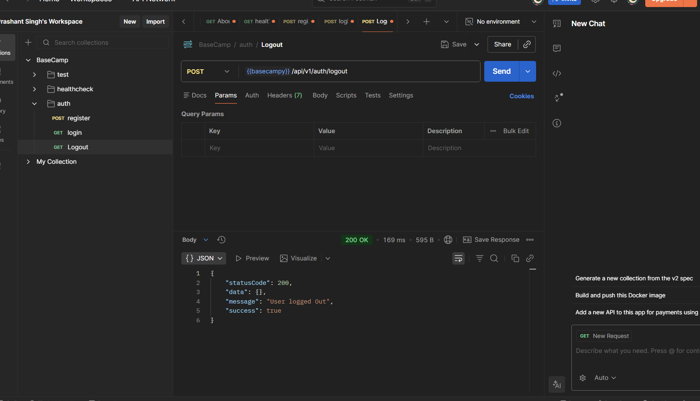
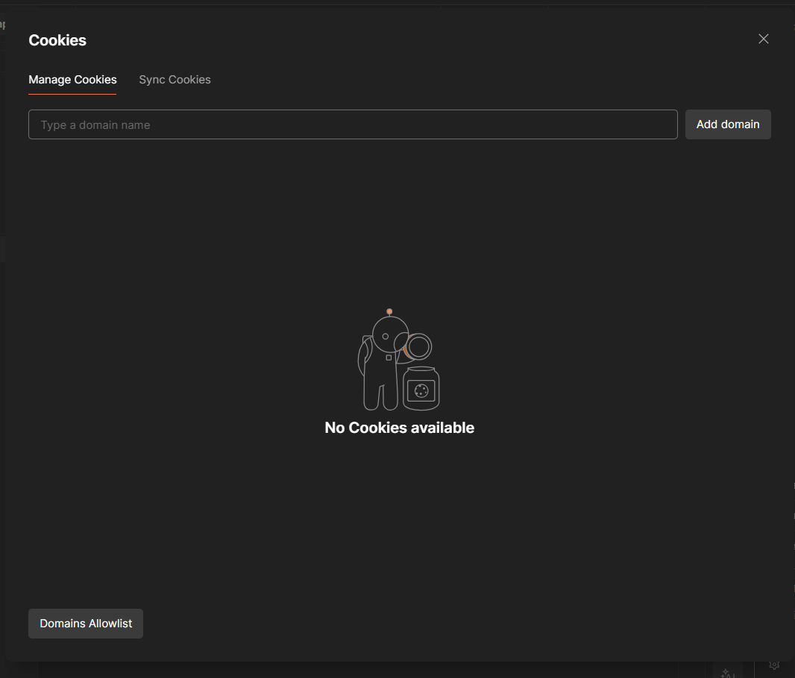

Now , Let's write the controller for logging out user 

*So the client is going to go ahead and send a request to the server that hey log me out automatically.*

*The access token will be sent via the cookies.*

*The middleware will intercept and validate whether you should actually request this route or not, and*

*then server will respond for a logout.*


So , go to `controllers` folder and go inside `auth.controllers.js` :

```js

const logoutUser = asyncHandler(async (req, res) => {
  await User.findByIdAndUpdate(
    // find and update
    req.user._id, //? what you want to find ?
    {
      $set: {
        refreshToken: "",
      },
    },
    {
      new: true, // That means once everything is done, give me the most updated object or the newer object that we have.
    },
  );

  const options = {
    httpOnly: true,
    secure: true,
  };

  // now send the response , we just have to remove or clear the cookies
  return res
    .status(200)
    .clearCookie("accessToken", options)
    .clearCookie("refreshToken", options)
    .json(new ApiResponse(200, {}, "User logged Out"));
});

export { registerUser, login, logoutUser };
```

now set the route for `logout` : 

```js

import { logoutUser } from "../controllers/auth.controllers.js";

// Secure Routes
router.route("/logout").post(verifyJWT , logoutUser);  // we just pass reference of JWT , here verifyJWT is a middleware


export default router;
```

Let's Test it with `Postman` : 






---
---

## Final Summary

# Logout Flow + Protected Route Notes

## Why Logout Needs Auth Middleware

Only a logged-in user should be able to logout.

So before logout controller runs, we first verify:

* Does the request contain a valid access token?
* Is the user authenticated?

That is why this route is protected using:

```js
router.route("/logout").post(verifyJWT , logoutUser);
```

Flow:

```text
Client Request
      ↓
verifyJWT middleware
      ↓
If token valid → req.user added
      ↓
logoutUser controller
```

---

# Real-Life Analogy

Imagine:

* **Access Token** = Your mall entry pass
* **Cookie** = Your pocket carrying the pass
* **Middleware** = Security guard
* **Controller** = Actual shop/service

Before entering the shop:

```text
Security Guard checks your pass
```

If valid:

```text
He allows you inside
```

If invalid:

```text
Access denied
```

That security guard is the `verifyJWT` middleware.

---

# Logout Route

```js
router.route("/logout").post(verifyJWT , logoutUser);
```

Meaning:

1. First run `verifyJWT`
2. If successful → run `logoutUser`

---

# How verifyJWT Works

## Step 1 → Client sends request

When user clicks logout:

```text
POST /logout
```

Browser automatically sends cookies:

```text
accessToken
refreshToken
```

---

## Step 2 → Middleware intercepts request

```js
verifyJWT
```

runs BEFORE controller.

---

## Step 3 → Extract token

```js
const token =
  req.cookies?.accessToken ||
  req.header("Authorization")?.replace("Bearer ", "");
```

Token can come from:

### Cookies (Web apps)

```text
req.cookies.accessToken
```

### Authorization Header (Mobile apps)

```text
Authorization: Bearer TOKEN
```

---

# Cookie Concept Here

## What is a Cookie?

A cookie is:

```text
Small data stored inside browser
```

Server can:

* store cookies
* read cookies
* delete cookies

---

# During Login

Server sends:

```js
.cookie("accessToken", accessToken, options)
.cookie("refreshToken", refreshToken, options)
```

Browser stores them automatically.

---

# Then on Every Request

Browser automatically attaches cookies:

```text
Request + accessToken cookie
```

So user stays logged in.

---

# Why cookie-parser?

Express cannot directly read cookies.

So we use:

```js
app.use(cookieParser())
```

Now Express can access:

```js
req.cookies
```

---

# Secure Cookie Options

```js
const options = {
  httpOnly: true,
  secure: true
}
```

## httpOnly

JavaScript cannot access cookies.

Protects from XSS attacks.

---

## secure

Cookie only sent over HTTPS.

---

# Step 4 → Verify JWT

```js
const decodedToken = jwt.verify(
    token,
    process.env.ACCESS_TOKEN_SECRET
)
```

This checks:

* token is genuine
* token is not modified
* token is valid

---

# Step 5 → Get User from DB

```js
const user = await User.findById(decodedToken?._id)
```

Because token contains:

```js
{
   _id,
   email,
   username
}
```

---

# Step 6 → Attach User to Request

```js
req.user = user
```

VERY IMPORTANT.

Now every next controller can access:

```js
req.user
```

without decoding token again.

---

# Why req.user?

Because middleware and controller share same `req` object.

So middleware adds:

```js
req.user
```

Controller receives it automatically.

---

# Logout Controller Flow

## Step 1 → Get current logged-in user

```js
req.user._id
```

This came from middleware.

---

# Step 2 → Remove Refresh Token from DB

```js
await User.findByIdAndUpdate(
  req.user._id,
  {
    $set: {
      refreshToken: ""
    }
  }
)
```

Meaning:

```text
Destroy server-side login session
```

---

# Why Remove Refresh Token?

Because refresh token can generate new access tokens.

If not removed:

```text
User may still stay authenticated
```

So logout removes it from DB.

---

# Step 3 → Clear Cookies

```js
.clearCookie("accessToken", options)
.clearCookie("refreshToken", options)
```

Browser deletes stored cookies.

---

# Final Logout Flow

```text
User clicks Logout
        ↓
Browser sends accessToken cookie
        ↓
verifyJWT middleware runs
        ↓
Token verified
        ↓
req.user created
        ↓
logoutUser controller runs
        ↓
Refresh token removed from DB
        ↓
Cookies cleared
        ↓
User logged out
```

---

# Important Understanding

## Middleware = Common Reusable Logic

Instead of checking token inside EVERY controller:

❌ Bad:

```text
login controller
profile controller
logout controller
update controller
```

all repeating token verification.

---

✅ Better:

```text
One auth middleware
```

used everywhere.

---

# Main Benefit of Auth Middleware

```text
Write once
Reuse everywhere
```

---

# Key Things Learned

## Login

* validate user
* generate tokens
* store cookies

---

## Cookies

* browser stores tokens
* browser automatically sends them later

---

## Middleware

* intercepts request
* checks authentication

---

## verifyJWT

* extracts token
* verifies token
* fetches user
* attaches `req.user`

---

## Logout

* remove refresh token from DB
* clear cookies
* user logged out


---
> # Important to Understand

No — **logging out does NOT remove the user account or user data**.

It mainly means:

```text
"Stop recognizing this user as logged in"
```

---

# What Actually Happens During Logout

When user logs out:

✅ Access tokens are removed
✅ Refresh tokens are removed
✅ Cookies are cleared

But:

❌ User account is NOT deleted
❌ User database data is NOT deleted
❌ Email/password are NOT removed

---

# Real-Life Analogy

Imagine:

* Your account = Your bank account
* Login token = ATM session card

When you logout:

```text
ATM card/session expires
```

But:

```text
Your bank account still exists
```

Exactly same here.

---

# In Your Code

## Step 1 → Remove Refresh Token from DB

```js
refreshToken: ""
```

Meaning:

```text
This user can no longer generate new access tokens
```

---

## Step 2 → Clear Browser Cookies

```js
.clearCookie("accessToken")
.clearCookie("refreshToken")
```

Meaning:

```text
Browser no longer has login tokens
```

So next requests become:

```text
Unauthorized
```

because user has no valid token anymore.

---

# What Remains After Logout?

Still stored in database:

✅ username
✅ email
✅ password
✅ profile image
✅ posts/projects/etc

Only authentication session is destroyed.

---

# Simple Difference

| Action         | What Happens                   |
| -------------- | ------------------------------ |
| Login          | Create authentication session  |
| Logout         | Destroy authentication session |
| Delete Account | Remove user data permanently   |

---

# Very Important Concept

## Login State ≠ User Existence

A user can exist in DB but still be:

```text
Logged out
```

because authentication tokens are missing.

---

# Why Remove Both Tokens?

## Access Token

Used to access protected routes.

---

## Refresh Token

Used to generate NEW access tokens.

If refresh token is not removed:

```text
User may still stay logged in indirectly
```

So logout removes BOTH.

---

# Final Meaning of Logout

```text
Logout = End current authenticated session
```

NOT:

```text
Delete user account
```
