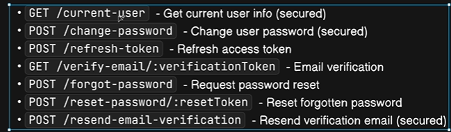

Here we have to work on these : 




Just Need to Write : 

`controllers` → `routes` 

`controllers` → `routes` 

`controllers` → `routes` 

`controllers` → `routes` 

And That's All ✅✅

---

Now go to `controllers` , inside `auth.controllers.js` file and write : 

```js

const getCurrentUser = asyncHandler(async (req, res) => {
  return res
    .status(200)
    .json(new ApiResponse(200, req.user, "Current user fetched successfully"));
});

const verifyEmail = asyncHandler(async (req, res) => {
  const { verificationToken } = req.params; // gives access of the URL

  if (!verificationToken) {
    throw new ApiError(400, "Email Verification token is missing");
  }

  let hashedToken = crypto
    .createHash("sha256")
    .update(verificationToken)
    .digest("hex");

  const user = await User.findOne({
    emailVerificationToken: hashedToken,
    emailVerificationExpiry: { $gt: Date.now() },
  });

  if (!user) {
    throw new ApiError(400, "Token is invalid or Expired");
  }

  // to ensure that unnecessary data is not present
  user.emailVerificationToken = undefined;
  user.emailVerificationExpiry = undefined;

  user.isEmailVerified = true;
  await user.save({ validateBeforeSave: false });

  return res.status(200).json(
    new ApiResponse(
      200,
      {
        isEmailVerified: true,
      },
      "Email is verified",
    ),
  );
});

const resendEmailVerification = asyncHandler(async (req, res) => {
  const user = await User.findById(req.user?._id);

  if (!user) {
    throw new ApiError(404, "User does not exist");
  }

  // if the email is already verified
  if (user.isEmailVerified) {
    throw new ApiError(409, "Email is Already verified");
  }

  const { unHashedToken, hashedToken, tokenExpiry } =
    user.generateTemporaryToken();

  user.emailVerificationToken = hashedToken;
  user.emailVerificationExpiry = tokenExpiry;

  await user.save({ validateBeforeSave: false });

  await sendEmail({
    email: user?.email,
    subject: "Please verify your email",
    mailgenContent: emailVerificationMailgenContent(
      user.username,
      `${req.protocol}://${req.get("host")}/api/v1/users/verify-email/${unHashedToken}`, // This is the URL
    ),
  });

  return res
    .status(200)
    .json(new ApiResponse(200, {}, "Mail has been sent to your email ID"));
});

const refreshAccessToken = asyncHandler(async (req , res) => {

    const incomingRefreshToken = req.cookies.refreshToken || req.body.refreshToken

    if(!incomingRefreshToken){
        throw new ApiError(401 , "Unauthorized Access")
    }

    try {
        const decodedToken = jwt.verify(incomingRefreshToken , process.env.REFRESH_TOKEN_SECRET)

        const user = await User.findById(decodedToken?._id);

        if(!user){
          throw new ApiError(401 , "Invalid refresh token");
        }

        if(incomingRefreshToken !== user?.refreshToken){
          throw new ApiError(401 , "Refresh token is expired")
        }

        const options = {
          httpOnly: true,
          secure: true
        }

        const {accessToken , refreshToken: newRefreshToken} =  await generateAccessAndRefreshTokens(user._id) 

        user.refreshToken = newRefreshToken;

        await user.save()

        return res
              .status(200)
              .cookie("accessToken" , accessToken , options)
              .cookie("refreshToken" , newRefreshToken , options)
              .json(
                new ApiResponse(
                  200,
                  {accessToken , refreshToken: newRefreshToken},
                  "Access token refreshed"
                )
              )

    } catch (error) {
        throw new ApiError(401 , "Invalid refresh token");
    }
})

export {
  registerUser,
  login,
  logoutUser,
  getCurrentUser,
  verifyEmail,
  resendEmailVerification,
  refreshAccessToken
};

```

---

## Final Summary 

# Notes: Current User, Email Verification, Refresh Token Flow

---

# 1. `GET /current-user`

Purpose:
Get details of the currently logged-in user.

This is a **protected route**, so `verifyJWT` middleware runs first.

Flow:

```text
Client Request
   ↓
verifyJWT middleware
   ↓
req.user gets added
   ↓
Controller sends req.user
```

Code:

```js
const getCurrentUser = asyncHandler(async (req, res) => {
  return res
    .status(200)
    .json(new ApiResponse(200, req.user, "Current user fetched successfully"));
});
```

Important:

```js
req.user
```

comes from:

```js
verifyJWT middleware
```

because middleware already decoded the token and fetched the user.

---

# 2. `verifyEmail`

Purpose:
Verify user's email using token sent in email.

Example verification link:

```text
http://localhost:8000/api/v1/users/verify-email/abc123token
```

Here:

```text
abc123token
```

is called:

```js
verificationToken
```

---

# Accessing URL Parameters

We already know:

```js
req.body
```

for body data.

For URL values:

```js
req.params
```

Example:

```js
const { verificationToken } = req.params;
```

---

# Route Example

```js
router.route("/verify-email/:verificationToken")
```

The `:` means dynamic value.

So:

```text
/verify-email/abc123
```

gives:

```js
req.params.verificationToken
```

---

# Why Hash Token Again?

During registration:

```text
Unhashed token → sent to email
Hashed token → stored in DB
```

When user clicks link:

```text
Incoming token is unhashed
```

So we hash it again:

```js
crypto
  .createHash("sha256")
  .update(verificationToken)
  .digest("hex");
```

Now hashed values match.

---

# Finding Valid User

```js
const user = await User.findOne({
  emailVerificationToken: hashedToken,
  emailVerificationExpiry: { $gt: Date.now() },
});
```

Meaning:

Find user where:

* token matches
* expiry time is greater than current time

---

# `$gt`

Means:

```text
greater than
```

So:

```js
{ $gt: Date.now() }
```

means:

```text
expiry must still be in future
```

---

# If Token Invalid

```js
if (!user) {
  throw new ApiError(400, "Token is invalid or Expired");
}
```

---

# Mark Email Verified

```js
user.isEmailVerified = true;
```

---

# Cleanup Unnecessary Data

After verification:

```js
user.emailVerificationToken = undefined;
user.emailVerificationExpiry = undefined;
```

Reason:

Token no longer needed.

---

# Save User

```js
await user.save({ validateBeforeSave: false });
```

---

# Final Response

```js
return res.status(200).json(
  new ApiResponse(
    200,
    {
      isEmailVerified: true,
    },
    "Email is verified",
  ),
);
```

---

# 3. `resendEmailVerification`

Purpose:

If old verification token expired, resend verification email.

---

# Route Protection

This is a protected route.

Why?

Because only logged-in user should resend verification mail.

So middleware gives:

```js
req.user
```

---

# Find User

```js
const user = await User.findById(req.user?._id);
```

---

# If User Not Found

```js
throw new ApiError(404, "User does not exist");
```

---

# If Already Verified

```js
if (user.isEmailVerified)
```

No need to resend email.

---

# Generate New Temporary Token

```js
const { unHashedToken, hashedToken, tokenExpiry } =
  user.generateTemporaryToken();
```

---

# Store New Token

```js
user.emailVerificationToken = hashedToken;
user.emailVerificationExpiry = tokenExpiry;
```

---

# Send Email

```js
await sendEmail({
  email: user?.email,
  subject: "Please verify your email",
});
```

---

# Verification URL

```js
`${req.protocol}://${req.get("host")}/api/v1/users/verify-email/${unHashedToken}`
```

Example:

```text
http://localhost:8000/api/v1/users/verify-email/abc123
```

---

# 4. Refresh Access Token

Purpose:

Generate new access token using refresh token.

---

# Why Needed?

Access token expires quickly.

Example:

```text
Access Token → 1 day
Refresh Token → 10 days
```

When access token expires:

```text
Client sends refresh token
```

Server generates new access token.

---

# Getting Refresh Token

```js
const incomingRefreshToken =
  req.cookies.refreshToken || req.body.refreshToken;
```

Can come from:

* cookies
* request body

---

# If No Refresh Token

```js
throw new ApiError(401, "Unauthorized Access");
```

---

# Verify Refresh Token

```js
const decodedToken = jwt.verify(
  incomingRefreshToken,
  process.env.REFRESH_TOKEN_SECRET
);
```

Important:

Use:

```js
REFRESH_TOKEN_SECRET
```

NOT access token secret.

---

# Find User

```js
const user = await User.findById(decodedToken?._id);
```

---

# Check Token Exists in DB

```js
if(incomingRefreshToken !== user?.refreshToken)
```

Why?

Because:

* user may have logged out
* refresh token may be deleted
* token may be old

---

# Generate New Tokens

```js
const { accessToken, refreshToken: newRefreshToken } =
  await generateAccessAndRefreshTokens(user._id);
```

---

# Save New Refresh Token

```js
user.refreshToken = newRefreshToken;
await user.save();
```

---

# Send New Cookies

```js
.cookie("accessToken", accessToken, options)
.cookie("refreshToken", newRefreshToken, options)
```

---

# Final Response

```js
.json(
  new ApiResponse(
    200,
    { accessToken, refreshToken: newRefreshToken },
    "Access token refreshed"
  )
)
```

---

# Full Refresh Flow

```text
Access Token expired
        ↓
Client sends Refresh Token
        ↓
Server verifies refresh token
        ↓
Server checks DB token
        ↓
Generate new access token
        ↓
Generate new refresh token
        ↓
Store new refresh token in DB
        ↓
Send both tokens again
```

---

# Important Concepts Learned

## `req.params`

Access values from URL.

Example:

```js
req.params.verificationToken
```

---

## Token Hashing

Never store raw token in DB.

Store hashed version.

---

## Token Expiry

```js
$gt: Date.now()
```

checks token validity.

---

## Protected Routes

Use:

```js
verifyJWT
```

before controller.

---

## Refresh Token Flow

Used to generate new access tokens without forcing user to login again.

---

# Easy Real-Life Analogy

## Access Token

Like:

```text
Mall entry pass
```

Short-lived.

---

## Refresh Token

Like:

```text
Permanent membership card
```

Used to get new entry pass.

---

## Email Verification Token

Like:

```text
OTP sent to your email
```

Only valid for limited time.
