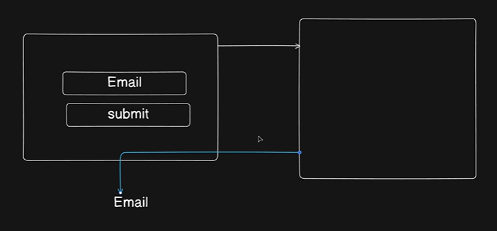

------------------------------
## Component-by-Component Mapping

* The Browser Form (Left Box): This matches your description of the "simple browser" interface. It features the exact input element where the user enters their "Email" and the "submit" button they click to trigger the process.
* The Server Request (Top White Arrow): This visualizes your text path where "once you hit the submit your data actually reaches onto the server."
* The Server Verification (Right Box): This represents the database check step outlined in your text ("We'll check that whether you are in the database or not").
* The Email Response (Bottom Blue Arrow): This maps to the final step of your text route: "if you have forgot your password... we send you an email. That's it." The blue arrow bypasses the original login screen and routes the response directly to the user's personal inbox ("Email" text at the bottom).

------------------------------
## Scope Definition
The diagram perfectly reflects your core point: Forgot Password is strictly a one-way loop. The diagram stops right after sending the email. It deliberately excludes input fields for a "New Password" or "Confirm Password" because, as your text emphasizes, changing the password is an entirely separate system route handled later.
If you are ready to write the backend code for this loop, tell me if you want to:

* Generate a secure crypto token to attach to that blue arrow link.
* Write the Express.js database lookup route for the right-hand server box.
* Configure Nodemailer to send out the physical email.


---

```js

const forgotPasswordRequest = asyncHandler(async (req, res) => {
  const { email } = req.body;

  const user = await User.findOne({ email });

  if (!user) {
    throw new ApiError(404, "User does not exist", []);
  }

  const { unHashedToken, hashedToken, tokenExpiry } =
    user.generateTemporaryToken();

  user.forgotPasswordToken = hashedToken;
  user.forgotPasswordExpiry = tokenExpiry;

  await user.save({ validateBeforeSave: false });

  await sendEmail({
    email: user?.email,
    subject: "Password reset Request",
    mailgenContent: forgotPasswordMailgenContent(
      user.username,
      `${process.env.FORGOT_PASSWORD_REDIRECT_URL}/${unHashedToken}`,
    ),
  });

  return res
    .status(200)
    .json(
      new ApiResponse(
        200,
        {},
        "Password reset mail has been sent on your mail ",
      ),
    );
});
```

`.env` : 

```js

FORGOT_PASSWORD_REDIRECT_URL = http://localhost:3000/forgot-password
```

**Remaining Controllers :**

```js

const resetForgotPassword = asyncHandler(async (req, res) => {
  const { resetToken } = req.params;
  const { newPassword } = req.body;

  let hashedToken = crypto
    .createHash("sha256")
    .update(resetToken)
    .digest("hex");

  const user = await User.findOne({
    forgotPasswordToken: hashedToken,
    forgotPasswordExpiry: { $gt: Date.now() },
  });

  if (!user) {
    throw new ApiError(489, "Token is invalid or expired");
  }

  // otherwise :
  user.forgotPasswordExpiry = undefined;
  user.forgotPasswordToken = undefined;

  user.password = newPassword;
  await user.save({ validateBeforeSave: false });

  return res
    .status(200)
    .json(new ApiResponse(200, {}, "Password reset successfully"));
});


---

// this is for somebody who is already logged in
const changeCurrentPassword = asyncHandler(async (req, res) => {
  const { oldPassword, newPassword } = req.body;

  const user = await User.findById(req.user?._id);

  const isPasswordValid = await user.isPasswordCorrect(oldPassword);

  if (!isPasswordValid) {
    throw new ApiError(400, "Invalid old password");
  }

  user.password = newPassword;
  await user.save({ validateBeforeSave: false });

  return res
    .status(200)
    .json(new ApiResponse(200, {}, "Password changed Successfully"));
});

export {
  registerUser,
  login,
  logoutUser,
  getCurrentUser,
  verifyEmail,
  resendEmailVerification,
  refreshAccessToken,
  forgotPasswordRequest,
  resetForgotPassword,
  changeCurrentPassword
};


```

---
---

## Final Summary

# Notes: Forgot Password, Reset Password, Change Password

---

# 1. Forgot Password Flow

Purpose:

User forgot password and wants to reset it.

---

# Real Life Flow

```text
User enters email
        ↓
Server checks user exists
        ↓
Server generates temporary token
        ↓
Server stores hashed token in DB
        ↓
Server sends reset link on email
```

---

# Important

Forgot Password route does NOT change password.

It only:

* checks email
* creates reset token
* sends email

Actual password changing happens later in:

```text
reset password route
```

---

# Controller

```js
const forgotPasswordRequest = asyncHandler(async (req, res) => {
```

---

# Step 1: Get Email

```js
const { email } = req.body;
```

User submits email from frontend.

Example:

```text
user@gmail.com
```

---

# Step 2: Find User

```js
const user = await User.findOne({ email });
```

---

# If User Not Found

```js
if (!user) {
  throw new ApiError(404, "User does not exist");
}
```

---

# Step 3: Generate Temporary Token

```js
const { unHashedToken, hashedToken, tokenExpiry } =
  user.generateTemporaryToken();
```

This creates:

| Value           | Purpose               |
| --------------- | --------------------- |
| `unHashedToken` | sent in email         |
| `hashedToken`   | stored in DB          |
| `tokenExpiry`   | token expiration time |

---

# Why Hash Token?

Security.

Never store raw token in database.

---

# Store Token in Database

```js
user.forgotPasswordToken = hashedToken;
user.forgotPasswordExpiry = tokenExpiry;
```

---

# Save User

```js
await user.save({ validateBeforeSave: false });
```

---

# Send Email

```js
await sendEmail({
  email: user?.email,
  subject: "Password reset Request",
});
```

---

# Reset Password URL

```js
`${process.env.FORGOT_PASSWORD_REDIRECT_URL}/${unHashedToken}`
```

Example:

```text
http://localhost:3000/forgot-password/abc123token
```

---

# Why Frontend URL?

Because user should open frontend page where they can type new password.

---

# Final Response

```js
return res
  .status(200)
  .json(
    new ApiResponse(
      200,
      {},
      "Password reset mail has been sent on your mail ",
    ),
  );
```

---

# Full Forgot Password Flow

```text
User clicks "Forgot Password"
        ↓
Enters email
        ↓
Server checks user
        ↓
Generate token
        ↓
Save hashed token in DB
        ↓
Send email with reset link
```

---

# 2. Reset Forgot Password

Purpose:

Actually change password using token from email.

---

# Real Life Flow

```text
User opens email
        ↓
Clicks reset link
        ↓
Frontend opens reset password page
        ↓
User enters new password
        ↓
Server verifies token
        ↓
Password updated
```

---

# Important Difference

| Feature         | Meaning                  |
| --------------- | ------------------------ |
| Forgot Password | send reset email         |
| Reset Password  | actually change password |

---

# Step 1: Get Token From URL

```js
const { resetToken } = req.params;
```

Example URL:

```text
/reset-password/abc123
```

Here:

```text
abc123
```

becomes:

```js
req.params.resetToken
```

---

# Step 2: Get New Password

```js
const { newPassword } = req.body;
```

---

# Step 3: Hash Incoming Token

```js
let hashedToken = crypto
  .createHash("sha256")
  .update(resetToken)
  .digest("hex");
```

Why?

Because database stores hashed token.

---

# Step 4: Find Valid User

```js
const user = await User.findOne({
  forgotPasswordToken: hashedToken,
  forgotPasswordExpiry: { $gt: Date.now() },
});
```

Meaning:

Find user where:

* token matches
* token not expired

---

# `$gt`

Means:

```text
greater than
```

So:

```js
{ $gt: Date.now() }
```

means:

```text
expiry time must still be in future
```

---

# If Token Invalid

```js
if (!user) {
  throw new ApiError(489, "Token is invalid or expired");
}
```

---

# Cleanup Token Fields

```js
user.forgotPasswordExpiry = undefined;
user.forgotPasswordToken = undefined;
```

Reason:

Token no longer needed.

---

# Set New Password

```js
user.password = newPassword;
```

---

# Important: Password Hashing

You are NOT manually hashing password here.

Why?

Because mongoose pre-save hook handles it automatically.

Example:

```js
userSchema.pre("save", async function(next) {
```

When password changes:

```text
hook automatically hashes password
```

---

# Save User

```js
await user.save({ validateBeforeSave: false });
```

---

# Final Response

```js
return res
  .status(200)
  .json(new ApiResponse(200, {}, "Password reset successfully"));
```

---

# Full Reset Password Flow

```text
User clicks reset link
        ↓
Frontend gets token
        ↓
User enters new password
        ↓
Server hashes token
        ↓
Checks DB token
        ↓
Checks expiry
        ↓
Updates password
        ↓
Deletes reset token
```

---

# 3. Change Current Password

Purpose:

Change password while already logged in.

---

# Difference

| Feature         | User Logged In? | Email Needed? |
| --------------- | --------------- | ------------- |
| Reset Password  | No              | Yes           |
| Change Password | Yes             | No            |

---

# Real Life Example

## Reset Password

```text
Forgot password
```

## Change Password

```text
Settings → Change Password
```

---

# Since User Already Logged In

Protected route uses:

```js
verifyJWT
```

Middleware already gives:

```js
req.user
```

---

# Step 1: Get Passwords

```js
const { oldPassword, newPassword } = req.body;
```

---

# Step 2: Find Current User

```js
const user = await User.findById(req.user?._id);
```

`req.user` came from middleware.

---

# Step 3: Verify Old Password

```js
const isPasswordValid =
  await user.isPasswordCorrect(oldPassword);
```

This method compares:

```text
Entered password
VS
Hashed DB password
```

using bcrypt.

---

# If Old Password Wrong

```js
if (!isPasswordValid) {
  throw new ApiError(400, "Invalid old password");
}
```

---

# Step 4: Set New Password

```js
user.password = newPassword;
```

Again:

mongoose hook auto-hashes password.

---

# Save User

```js
await user.save({ validateBeforeSave: false });
```

---

# Final Response

```js
return res
  .status(200)
  .json(new ApiResponse(200, {}, "Password changed Successfully"));
```

---

# Full Change Password Flow

```text
Logged-in user
        ↓
Enter old password
        ↓
Enter new password
        ↓
Server checks old password
        ↓
If correct:
        ↓
Update password
        ↓
Hash password automatically
        ↓
Save new password
```

---

# Key Concepts Learned

---

# `req.params`

Access URL values.

Example:

```js
req.params.resetToken
```

---

# Temporary Tokens

Used for:

* email verification
* forgot password

---

# Token Expiry

```js
{ $gt: Date.now() }
```

checks whether token still valid.

---

# Password Hashing

Handled automatically by mongoose pre-save hook.

---

# Protected Route

```js
verifyJWT
```

adds:

```js
req.user
```

---

# Easy Analogy

## Forgot Password

Like:

```text
You forgot locker key
```

You request school office for temporary reset slip.

---

## Reset Password

Like:

```text
Using temporary reset slip to set new locker key
```

---

## Change Password

Like:

```text
You already know current key,
but want a new one
```
