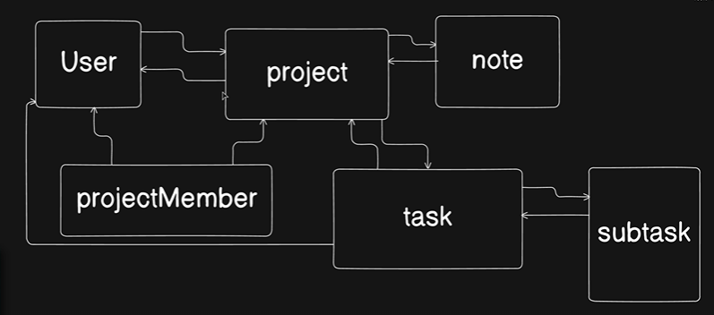

Lets make more models ;



Go to `models` , create `project.models.js` , `projectmember.models.js` , `task.models.js` , `subtask.models.js` , `note.models.js`


at first go to `project.models,js` : 

```js
import mongoose , {Schema} from "mongoose";

const projectSchema = new Schema({

    name: {
        type: String,
        requires: true,
        unique: true,
        trim: true
    },

    description: {
        type: string
    },
    createdBy: {
        type: Schema.Types.ObjectId,
        ref: "User",
        required: true
    }
}, {timestamp: true}) 

export const Project = mongoose.model("Project" , projectSchema)
```

Lets work on `projectmember.models.js` : 

```js

import mongoose, { Schema } from "mongoose";
import { AvailableUserRole, UserRolesEnum } from "../utils/constants.js";

const projectMemberSchema = new Schema(
  {
    user: {
      type: Schema.Types.ObjectId,
      ref: "User",
      required: true,
    },
    project: {
      type: schema.Types.ObjectId,
      ref: "Project",
      required: true,
    },
    role: {
      type: String,
      enum: AvailableUserRole,
      default: UserRolesEnum.MEMBER,
    },
  },
  { timestamps: true },
);

export const ProjectMember = mongoose.model("ProjectMember",projectMemberSchema,);

```

Next : `task.models.js` :

```js
import mongoose ,{Schema, schema} from "mongoose"
import { AvailableTaskStatuses , TaskStatusEnum } from "../utils/constants.js"

const taskSchema = new Schema({

    title: {
        type: String,
        required: true,
        trim: true
    },
    description: {
        type: string
    },
    project: {
        type: Schema.Types.ObjectId,
        ref: "Project",
        required: true
    },
    assignedTo: {
        type: Schema.Types.ObjectId,
        ref: "User",
    },
    assignedBy: {
        type: Schema.Types.ObjectId,
        ref: "User",
    },
    status: {
        type: String,
        enum: AvailableTaskStatuses,
        default: TaskStatusEnum.TODO
    },
    attachments: {
        type: [{
            url: String,
            mimetype: String,
            size: Number
        }],
        default: []
    }

} , {timestamps: true})

export const Task = mongoose.model("Task" , taskSchema)
```

Next : 

```js
import mongoose, { schema } from "mongoose";

const subTaskSchema = new Schema({
  title: {
    type: String,
    required: true,
    trim: true,
  },
  task: {
    type: Schema.Types.ObjectId,
    ref: "Task",
    required: true,
  },
  isCompleted: {
    type: Boolean,
    default: false,
  },
  createdBy: {
    type: Schema.Types.ObjectId,
    ref: "User",
    required: true,
  },
});

export const Subtask = mongoose.model("Subtask", subTaskSchema);

```


# Finally : 

`note.models.js` : 

```js

import mongoose, { Schema } from "mongoose";

const projectNoteSchema = new Schema(
  {
    project: {
      type: Schema.Types.ObjectId,
      ref: "Project",
      required: true,
    },
    createdBy: {
      type: Schema.Types.ObjectId,
      ref: "User",
      required: true,
    },
    content: {
      type: String,
      required: true,
    },
  },
  { timestamps: true },
);

export const ProjectNote = mongoose.model("ProjectNote", projectNoteSchema);

```

