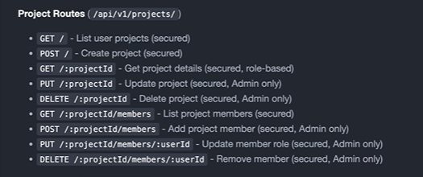

We will be working on project controllers Now



Go to `Controllers` folder and create file : `project.controllers.js` :

```js

import { User } from "../models/user.models.js";
import { Project } from "../models/project.models.js";
import { ProjectMember } from "../models/projectmember.models.js";
import { ApiResponse } from "../utils/api-response.js";
import { ApiError } from "../utils/api-error.js";
import { asyncHandler } from "../utils/async-handler.js";

const getProjects = asyncHandler(async (req, res) => {
  // test
});

const getProjectById = asyncHandler(async (req, res) => {
  // code
});

const createProject = asyncHandler(async (req, res) => {
  // test
});

const updateProject = asyncHandler(async (req, res) => {

});

const deleteProject = asyncHandler(async (req, res) => {
    
});

const addMembersToProject = asyncHandler(async (req, res) => {
  //
});

const getProjectMembers = asyncHandler(async (req, res) => {
  //
});

const updateMemberRole = asyncHandler(async (req, res) => {
  //
});

const deleteMember = asyncHandler(async (req, res) => {
  //
});

export {
  addMembersToProject,
  updateMemberRole,
  updateProject,
  getProjectById,
  deleteMember,
  deleteProject,
  getProjectMembers,
  getProjectMembers,
  createProject,
};

```

We just planned the controllers , not fully written the logic , 


