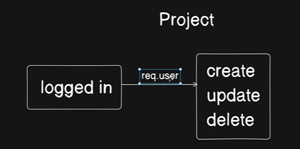

## Core Objective

* Write three project controllers: create, update, and delete.

## Key Assumption (The Flow)

* Pre-authenticated users: Users are already logged in before hitting these endpoints.
* Middleware execution: A verifyJWT middleware executes before reaching the controllers.
* Data availability: The middleware attaches user details directly to the request object.
* Controller access: The controllers can reliably extract user info from req.user at any time.

------------------------------


```js

const createProject = asyncHandler(async (req, res) => {

    // user pass these two details
    const {name , description} = red.body

    const project = await Project.create({
        name,
        description,
        createdBy: new mongoose.Types.ObjectId(req.user._id),  // This will make sure that Mongo, whatever the object ID we are passing up, it is 100% mongoose object ID.
    })

    await ProjectMember.create({
        user: new mongoose.Types.ObjectId(req.user._id),
        project: new mongoose.Types.ObjectId(project._id),
        role: UserRolesEnum.ADMIN
    })

    return res
            .status(201)
            .json(
                new ApiResponse(
                    201,
                    project,
                    "Project Created Successfully"
                )
            )
});
```

```js

const updateProject = asyncHandler(async (req, res) => {
  const { name, description } = req.body;
  const { projectId } = req.params;

  const project = await project.findByIdAndUpdate(
    projectId,
    {
      name,
      description,
    },
    {
      new: true,
    },
  );

  if (!project) {
    throw new ApiError(404, "Project not found");
  }

  return res
    .status(200)
    .json(new ApiResponse(200, project, "Project updated successfully"));
});
```

```js

const deleteProject = asyncHandler(async (req, res) => {

    const {projectId} = req.params

    const project = await Project.findByIdAndDelete(projectId)

    if(!project){
        throw new ApiError(404 , "Project noy found")
    }

    return res
            .status(200)
            .json(
                new ApiResponse(200 , project , "Project deleted Successfully")
            )
});
```


> =============

here we have to `break` the flow :

> 👉 first study the `MongoDB aggregation pipelines` then continue from `144`

> =============


# Full Explanation : 

### Notes: Project Controllers (Create, Update, Delete)

This section starts the **Project Module** of the application.

**Important Assumption:**

* User authentication is already completed.
* Every protected route uses `verifyJWT`.
* Therefore `req.user` is always available.
* We can access the logged-in user's ID using:

```js
req.user._id
```

---

# 1. Create Project

### Purpose

Create a new project and automatically make the creator an **Admin** of that project.

---

## Step 1: Get data from request body

```js
const { name, description } = req.body;
```

Expected request:

```json
{
  "name": "Task Manager",
  "description": "A project management application"
}
```

---

## Step 2: Create Project Document

```js
const project = await Project.create({
  name,
  description,
  createdBy: new mongoose.Types.ObjectId(req.user._id),
});
```

### Why use `new mongoose.Types.ObjectId()`?

Although `req.user._id` usually works directly:

```js
createdBy: req.user._id
```

explicitly converting it ensures MongoDB stores it as a proper ObjectId.

---

### Example Project Document

```json
{
  "_id": "project123",
  "name": "Task Manager",
  "description": "A project management application",
  "createdBy": "user456"
}
```

---

## Step 3: Add Creator as Project Member

Creating the project is not enough.

We also create an entry inside the ProjectMember collection.

```js
await ProjectMember.create({
  user: new mongoose.Types.ObjectId(req.user._id),
  project: new mongoose.Types.ObjectId(project._id),
  role: UserRolesEnum.ADMIN,
});
```

---

### ProjectMember Document

```json
{
  "user": "user456",
  "project": "project123",
  "role": "ADMIN"
}
```

This ensures the creator becomes the administrator of the project.

---

## Step 4: Send Response

```js
return res
  .status(201)
  .json(
    new ApiResponse(
      201,
      project,
      "Project Created Successfully"
    )
  );
```

---

## Flow Diagram

```text
Request
   |
   v
Get name & description
   |
   v
Create Project
   |
   v
Create ProjectMember(Admin)
   |
   v
Return Response
```

---

# 2. Update Project

### Purpose

Update project name and/or description.

---

## Step 1: Get Data

```js
const { name, description } = req.body;
const { projectId } = req.params;
```

Example URL:

```text
/api/v1/projects/123
```

Then:

```js
projectId = "123"
```

---

## Step 2: Update Project

```js
const project = await Project.findByIdAndUpdate(
  projectId,
  {
    name,
    description,
  },
  {
    new: true,
  }
);
```

---

### Meaning of `new: true`

Without it:

```js
findByIdAndUpdate()
```

returns the old document.

With:

```js
new: true
```

MongoDB returns the updated document.

---

Example:

Before:

```json
{
  "name": "Old Name"
}
```

After update:

```json
{
  "name": "New Name"
}
```

The returned value will contain:

```json
{
  "name": "New Name"
}
```

---

## Step 3: Check Project Exists

```js
if (!project) {
  throw new ApiError(404, "Project not found");
}
```

---

## Step 4: Send Response

```js
return res
  .status(200)
  .json(
    new ApiResponse(
      200,
      project,
      "Project updated successfully"
    )
  );
```

---

## Flow Diagram

```text
Receive projectId
        |
        v
Find Project
        |
        v
Update Data
        |
        v
Project Found?
   /          \
 No            Yes
 |              |
404 Error       |
                v
          Return Updated Project
```

---

# 3. Delete Project

### Purpose

Delete an existing project.

---

## Step 1: Get Project ID

```js
const { projectId } = req.params;
```

---

## Step 2: Delete Project

```js
const project =
  await Project.findByIdAndDelete(projectId);
```

---

### What happens?

MongoDB:

1. Finds project by ID
2. Removes it
3. Returns deleted document

---

## Step 3: Check Project Exists

```js
if (!project) {
  throw new ApiError(
    404,
    "Project not found"
  );
}
```

---

## Step 4: Return Response

```js
return res
  .status(200)
  .json(
    new ApiResponse(
      200,
      project,
      "Project deleted Successfully"
    )
  );
```

---

# Common Interview Questions

### Q1. Why create a ProjectMember document immediately after creating a Project?

Because every project should have at least one member (the creator).

Otherwise:

* Project exists
* No members exist
* No one has permissions

Creating the ProjectMember document ensures the creator becomes the Admin.

---

### Q2. Why use `findByIdAndUpdate()` instead of `findOneAndUpdate()`?

Because we already know the project's `_id`.

Using ID is simpler and faster.

---

### Q3. What does `new: true` do?

Returns the updated document instead of the old document.

---

### Q4. What if `findByIdAndUpdate()` doesn't find a project?

It returns:

```js
null
```

Hence:

```js
if (!project)
```

check is required.

---

### Mistakes in the Provided Code

#### 1. Typo

```js
const { name, description } = red.body;
```

Should be:

```js
const { name, description } = req.body;
```

---

#### 2. Wrong Model Name

```js
const project = await project.findByIdAndUpdate(...)
```

Should be:

```js
const project = await Project.findByIdAndUpdate(...)
```

(`Project` model starts with capital `P`)

---

#### 3. Typo in Error Message

```js
"Project noy found"
```

Should be:

```js
"Project not found"
```

---

### Time Complexity

| Operation            | Complexity |
| -------------------- | ---------- |
| Create Project       | O(1)       |
| Create ProjectMember | O(1)       |
| Update Project by ID | O(1)       |
| Delete Project by ID | O(1)       |

(Assuming MongoDB indexes `_id`, which it does by default.)

---

Next, the instructor will implement:

1. **Get All Projects** (Aggregation Pipeline)
2. **Get Project By ID** (Aggregation Pipeline)

These are more important because they introduce MongoDB aggregation stages like `$match`, `$lookup`, `$project`, and `$addFields`.
