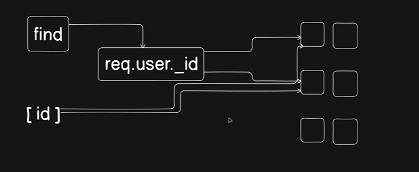

**📌 Summary of the Query Process**

* **Extract User ID:** The system extracts the unique user ID (req.user._id) from the incoming request object.

* **Execute Find Method:** The find method acts as a query tool that takes this user ID as a filtering parameter.

* **Filter Database Documents:** The database contains many documents (represented by the boxes on the right), but not all belong to this user.

* **Match and Return:** The query scans the database, matches only the documents where the creator's ID equals req.user._id, and returns them as an array of results.


```js


const getProjects = asyncHandler(async (req, res) => {

  const projects = await ProjectMember.aggregate([
    {
      $match: {
        user: new mongoose.Types.ObjectId(req.user._id),
      }
    },
    {
      $lookup: {
        from: "projects",     // this is looking up in database directly
        localField:"projects",
        foreignField: "_id",
        as: "projects",
        pipeline: [{
          $lookup: {
            from: "projectmembers",
            localField: "_id",
            foreignField: "projects",
            as: "projectmembers"
          }
        },
        {
          $addFields: {
            members: {
              $size: "$projectmembers",
            }
          }
        }
      ]
      }
    },
    {
      $unwind: "$project"
    },
    {
      $project: {
        project: {
          _id: 1,
          name: 1,
          description: 1,
          members: 1,
          createdAt: 1,
          createdBy: 1
        },
        role: 1,
        _id: 0
      }  
    }
  ]) 

  return res.status(200).json(new ApiResponse(200 , projects , "projects fetched successfully"))
});
```


Similarly : 

```js


const getProjectById = asyncHandler(async (req, res) => {

    const {projectId} = req.params

    const project = await Project.findById(projectId)

    if(!project){
      throw new ApiError(404 , "Project not found")
    }

    return res.status(200).json(
      new ApiResponse(200 , project , "Project fetched successfully")
    )
});
```


```js

const addMembersToProject = asyncHandler(async (req, res) => {
    
    const {email , role} = req.body
    const {projectId} = req.params

    const user  =  await User.findOne({email})

    if(!user){
      throw new ApiError(404 , "User does not exist")
    }

    await ProjectMember.findByIdAndUpdate(
      {
        user: new mongoose.Types.ObjectId(user._id),    // finding this data
        project: new mongoose.Types.ObjectId(projectId)
      },
      {
        user: new mongoose.Types.ObjectId(user._id),
        project: new mongoose.Types.ObjectId(projectId),
        role: role                                          // updating the role in the user
      }, 
      {
        new: true,   // return the updated document
        upsert:  true   // creates a new document if none of them exists
      }
    )

    return res.status(200).json(
      new ApiResponse(
        200 , {} , "Project Member added successfully"
      )
    )

});
```


```js

const getProjectMembers = asyncHandler(async (req, res) => {

    const {projectId} = req.params

    const project = await Project.findById(req.params)

    if(!project){
      throw new ApiError(404 , "Project not found")
    }

    const projectMembers = await ProjectMember.aggregate([
      {
        $match: {
          project: new mongoose.Types.ObjectId(projectId)
        }
      },
      {

        $lookup: {
          from: "users",
          localField: "user",
          foreignField: "_id",
          as: "user",
          pipeline: [
            {
              $project: {
                _id: 1,
                username: 1,
                fullname: 1,
                avatar: 1
              }
            }
          ]
        }
      },
      {
        $addFields: {
          user: {
            $arrayElemAt: ["$user" , 0]
          }
        }
      },
      {
        $project: {
          project: 1,
          user: 1,
          role: 1,
          ceratedAt: 1,
          updatedAt: 1,
          _id: 0
        }
      }
    ])

    return res.status(200).json(
      new ApiResponse(200 , projectMembers , "Project members fetched")
    )
});
```   


---


```js

const getProjectMembers = asyncHandler(async (req, res) => {

    const {projectId} = req.params

    const project = await Project.findById(req.params)

    if(!project){
      throw new ApiError(404 , "Project not found")
    }

    const projectMembers = await ProjectMember.aggregate([
      {
        $match: {
          project: new mongoose.Types.ObjectId(projectId)
        }
      },
      {

        $lookup: {
          from: "users",
          localField: "user",
          foreignField: "_id",
          as: "user",
          pipeline: [
            {
              $project: {
                _id: 1,
                username: 1,
                fullname: 1,
                avatar: 1
              }
            }
          ]
        }
      },
      {
        $addFields: {
          user: {
            $arrayElemAt: ["$user" , 0]
          }
        }
      },
      {
        $project: {
          project: 1,
          user: 1,
          role: 1,
          ceratedAt: 1,
          updatedAt: 1,
          _id: 0
        }
      }
    ])

    return res.status(200).json(
      new ApiResponse(200 , projectMembers , "Project members fetched")
    )
});
```

---

```js

const updateMemberRole = asyncHandler(async (req, res) => {
    
    const {projectId , userId} = req.params
    const {newRole} = req.body

    if(!AvailableUserRole.includes(newRole)){
      throw new ApiError(400 , "Invalid role")
    }

    let projectMember = await ProjectMember.findOne({
      project: new mongoose.Types.ObjectId(projectId),
      user: new mongoose.Types.ObjectId(userId)
    })


    if(!projectMember){
      throw new ApiError(400 , "Project member not found")
    }

    projectMember = await ProjectMember.findByIdAndUpdate(
      projectMember._id,
      {
        role: newRole
      },
      {
        new: true
      }
    )

    if(!projectMember){
      throw new ApiError(400 , "Project member not found")
    }

    return res.status(200).json(new ApiResponse(200 , projectMember , "Project member role updated successfully"))
});
```


---


```js


```