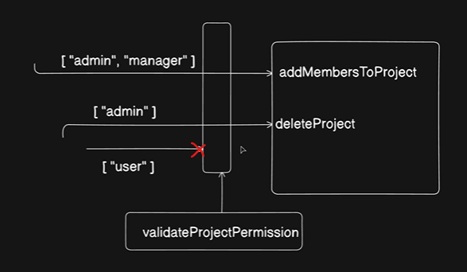

The provided text and image outline the implementation of a centralized Role-Based Access Control (RBAC) system using middleware.

------------------------------
## 📌 Summary of the Permission Architecture

* The Problem: Current controllers (like deleteProject or addMembersToProject) only check if a user is logged in via JWT. They do not prevent a regular user from performing administrative actions.
* The Solution: Introduce a centralized middleware function named validateProjectPermission to intercept incoming requests before they reach the controllers.
* Array-Based Rules: The middleware accepts an array of allowed roles as configuration input for each specific route.
* Traffic Control (The Gateway):
   * Allowed: If a request carries an authorized role matching the array (e.g., ["admin", "manager"] for adding members, or ["admin"] for deleting projects), the gateway lets it pass.
   * Blocked: If a regular ["user"] attempts to access an unauthorized action, the middleware blocks the request (indicated by the red X in the diagram) and prevents it from executing the controller logic.


---
---

We will do this part in the same `auth.middlewares.js` file 


```js


export const validateProjectPermission = (roles = []) => {
  asyncHandler(async (req, res, next) => {
    const { projectId } = req.params;

    if (!projectId) {
      throw new ApiError(400, "Project id is missing");
    }

    // project member document
    const project = await ProjectMember.findOne({
      project: new mongoose.Types.ObjectId(projectId),
      user: new mongoose.Types.ObjectId(req.user._id),
    });

    if (!project) {
      throw new ApiError(400, "Project not found");
    }

    //todo
    // I have actually taken up this role from the database itself.
    // I'm not relying you on you that what you are saying you are.
    // You might say that I'm admin but I'm not trusting you.

    const givenRole = project?.role;

    req.user.role = givenRole;

    // check if roles[] contain the "givenRole"
    if (!roles.includes(givenRole)) {
      throw new ApiError(
        403,
        "You do not have permission to perform this action",
      );
    }


    next()
  });
};

```

---
---
## Explanation : 

---
---

This middleware is implementing **Role-Based Access Control (RBAC)** for projects.

The idea is:

> "Just because a user is logged in doesn't mean they can perform every action on a project."

For example:

| User     | Role   |
| -------- | ------ |
| Prashant | ADMIN  |
| Rahul    | MEMBER |

Only ADMIN should be allowed to:

* Delete project
* Add members
* Remove members
* Change roles

While MEMBER can:

* View project
* View tasks

---

# Why do we need this?

Suppose somebody sends:

```http
DELETE /projects/123
```

Even if they are logged in, we need to verify:

1. Are they part of this project?
2. What role do they have?

This middleware does exactly that.

---

# Step 1

```js
export const validateProjectPermission = (roles = []) => {
```

This is a middleware factory.

It returns a middleware.

Example:

```js
router.delete(
  "/:projectId",
  verifyJWT,
  validateProjectPermission([UserRolesEnum.ADMIN]),
  deleteProject
);
```

Here:

```js
roles = ["ADMIN"]
```

Meaning:

> Only ADMIN can proceed.

---

# Step 2

```js
const { projectId } = req.params;
```

Gets:

```http
/projects/123
```

So:

```js
projectId = "123"
```

---

# Step 3

```js
if (!projectId) {
  throw new ApiError(400, "Project id is missing");
}
```

If URL is invalid:

```http
/projects/
```

Then:

```json
{
  "message": "Project id is missing"
}
```

---

# Step 4

Search ProjectMember collection

```js
const project = await ProjectMember.findOne({
  project: new mongoose.Types.ObjectId(projectId),
  user: new mongoose.Types.ObjectId(req.user._id),
});
```

Imagine ProjectMember table:

```js
[
  {
    user: "u1",
    project: "p1",
    role: "ADMIN"
  },
  {
    user: "u2",
    project: "p1",
    role: "MEMBER"
  }
]
```

Current user:

```js
req.user._id = "u2"
```

Project:

```js
projectId = "p1"
```

Query:

```js
findOne({
  project: "p1",
  user: "u2"
})
```

Result:

```js
{
  user: "u2",
  project: "p1",
  role: "MEMBER"
}
```

---

# Step 5

Check if user belongs to project

```js
if (!project) {
  throw new ApiError(400, "Project not found");
}
```

This means:

```text
User is not even a member of this project
```

or

```text
Project doesn't exist
```

Then stop.

---

# Important Part

The instructor's comment:

```js
// I'm not trusting you.
```

This is extremely important.

Suppose client sends:

```json
{
  "role": "ADMIN"
}
```

Should we trust that?

❌ Never.

Anyone can open Postman and send:

```json
{
  "role": "SUPER_ADMIN"
}
```

---

Instead we do:

```js
const givenRole = project?.role;
```

We read role from database.

Database says:

```js
role = "MEMBER"
```

Then role is MEMBER.

Not what client claims.

This is a security principle:

> Never trust client input for authorization.

---

# Step 6

```js
req.user.role = givenRole;
```

Attach role to request.

Now future middleware/controllers can use:

```js
req.user.role
```

Example:

```js
console.log(req.user.role);
```

Output:

```js
ADMIN
```

---

# Step 7

Permission check

```js
if (!roles.includes(givenRole))
```

Suppose:

```js
roles = ["ADMIN"]
```

and

```js
givenRole = "MEMBER"
```

Then:

```js
["ADMIN"].includes("MEMBER")
```

returns

```js
false
```

So:

```js
throw new ApiError(
  403,
  "You do not have permission"
);
```

---

Another example:

```js
roles = ["ADMIN", "PROJECT_ADMIN"]
```

Database says:

```js
givenRole = "ADMIN"
```

Then:

```js
["ADMIN", "PROJECT_ADMIN"]
.includes("ADMIN")
```

returns

```js
true
```

User is allowed.

---

# Step 8

```js
next();
```

If everything passed:

* Project exists ✅
* User belongs to project ✅
* Role is allowed ✅

Move to next middleware/controller.

---

# Complete Flow Example

Suppose route:

```js
router.delete(
  "/:projectId",
  verifyJWT,
  validateProjectPermission([
    UserRolesEnum.ADMIN
  ]),
  deleteProject
);
```

---

### Database

```js
ProjectMember
{
  user: u1,
  project: p1,
  role: "ADMIN"
}

{
  user: u2,
  project: p1,
  role: "MEMBER"
}
```

---

### Case 1: u1 deletes project

```js
givenRole = "ADMIN"
```

Check:

```js
["ADMIN"].includes("ADMIN")
```

✅ true

Controller runs:

```js
deleteProject()
```

---

### Case 2: u2 deletes project

```js
givenRole = "MEMBER"
```

Check:

```js
["ADMIN"].includes("MEMBER")
```

❌ false

Response:

```json
{
  "message": "You do not have permission to perform this action"
}
```

---

# One Small Bug

Your code currently has:

```js
export const validateProjectPermission = (roles = []) => {
  asyncHandler(async (req, res, next) => {
```

But you're not returning the middleware.

It should be:

```js
export const validateProjectPermission = (roles = []) => {
  return asyncHandler(async (req, res, next) => {
    ...
    next();
  });
};
```

Otherwise Express won't receive the middleware function.

---

### In one sentence

This middleware checks **whether the logged-in user belongs to the project and whether their database-stored role is one of the allowed roles before allowing the requested action to proceed.**
