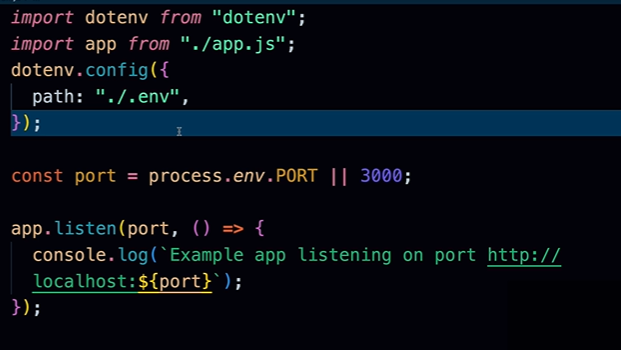

make an `app.js` file and move this part from index to app

```
import express from "express"

const app = express();


// Basic Home Route
app.get("/", (req, res) => {
  res.send("Hello World! Server is running successfully.");
});


// Instagram Route Example
app.get("/instagram", (req, res) => {
  res.send("This is an Instagram page.");
});

export default app;

```


and import app to `index.js`

```
import app from "./app.js"
```

Now `app.js` is responsible for **express** configuration


## Final `Index.js` file ->

