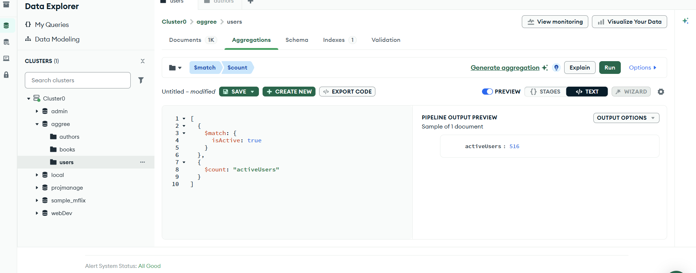
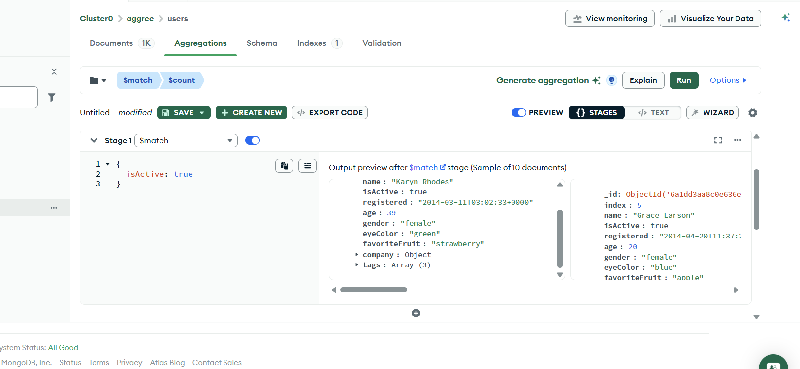
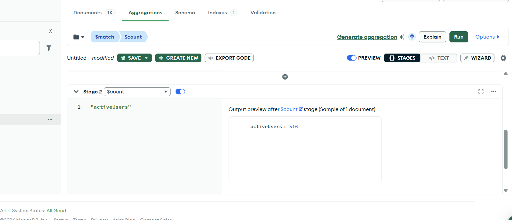

## Q. Find how many users are active



Stage 1:



Stage 2:



---

# Explanation : 

---

Yes. Today we essentially learned the **first real aggregation pipeline** in MongoDB.

From your screenshot, the pipeline is:

```js
[
  {
    $match: {
      isActive: true
    }
  },
  {
    $count: "activeUsers"
  }
]
```

Output:

```js
{
  activeUsers: 516
}
```

---

# What is Aggregation?

Think of Aggregation as:

```text
Documents
    ↓
Apply Stage 1
    ↓
Apply Stage 2
    ↓
Apply Stage 3
    ↓
Final Result
```

Each stage transforms the data and passes it to the next stage.

---

# Stage 1: `$match`

```js
{
  $match: {
    isActive: true
  }
}
```

This works exactly like a filter.

Suppose your collection contains:

```js
[
  { name: "A", isActive: true },
  { name: "B", isActive: false },
  { name: "C", isActive: true },
  { name: "D", isActive: false }
]
```

After `$match`:

```js
[
  { name: "A", isActive: true },
  { name: "C", isActive: true }
]
```

The inactive users are removed.

---

# Stage 2: `$count`

```js
{
  $count: "activeUsers"
}
```

Now MongoDB counts the documents coming from the previous stage.

Input to `$count`:

```js
[
  { name: "A", isActive: true },
  { name: "C", isActive: true }
]
```

Count = 2

Output:

```js
{
  activeUsers: 2
}
```

The string `"activeUsers"` becomes the field name.

---

# Complete Flow

```text
users collection
       |
       |
       v
+----------------+
|    $match      |
| isActive=true  |
+----------------+
       |
       v
Only active users remain
       |
       v
+----------------+
|    $count      |
+----------------+
       |
       v
{
 activeUsers: 516
}
```

---

# SQL Equivalent

If you've seen SQL, this aggregation is equivalent to:

```sql
SELECT COUNT(*)
FROM users
WHERE isActive = true;
```

MongoDB version:

```js
[
  {
    $match: {
      isActive: true
    }
  },
  {
    $count: "activeUsers"
  }
]
```

---

# Why Learn This?

Because the next project controllers (`getProjects`, `getProjectById`) will use aggregation heavily.

You'll soon encounter:

| Stage        | Purpose               |
| ------------ | --------------------- |
| `$match`     | Filter documents      |
| `$lookup`    | Join collections      |
| `$group`     | Group data            |
| `$project`   | Select fields         |
| `$sort`      | Sort data             |
| `$addFields` | Add calculated fields |
| `$count`     | Count documents       |

Today's aggregation only used **2 stages**:

```js
$match → $count
```

which is the simplest aggregation pipeline possible.

---

### One Interview Question

What is the difference between:

```js
User.countDocuments({ isActive: true });
```

and

```js
User.aggregate([
  { $match: { isActive: true } },
  { $count: "activeUsers" }
]);
```

**Answer:**

* `countDocuments()` is simpler and faster when you only need a count.
* Aggregation is more flexible because you can add more stages before counting.

Example:

```js
[
  { $match: { isActive: true } },
  { $lookup: {...} },
  { $group: {...} },
  { $count: "activeUsers" }
]
```

This is why aggregation is so powerful and why the instructor is preparing you for the upcoming project APIs.

