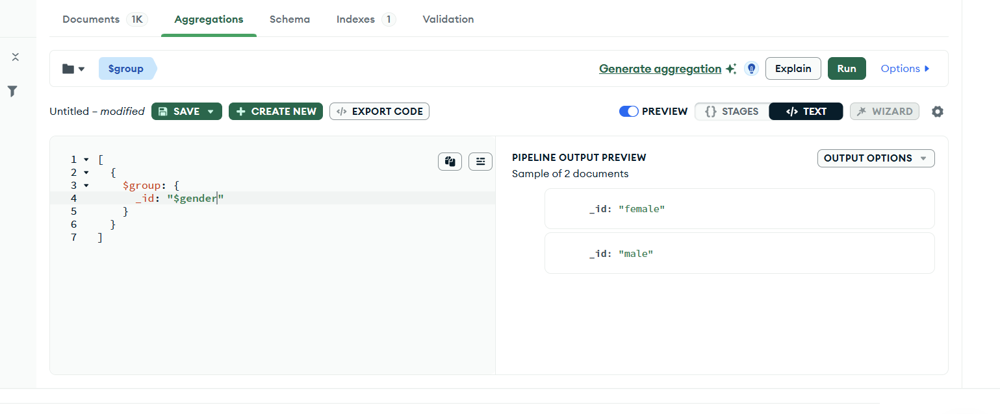
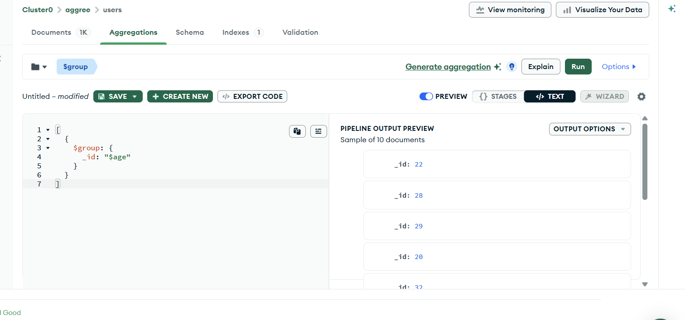
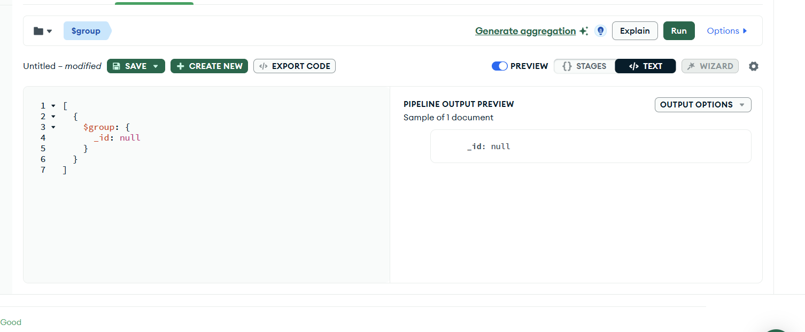
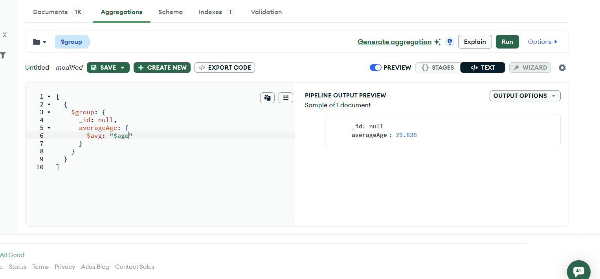
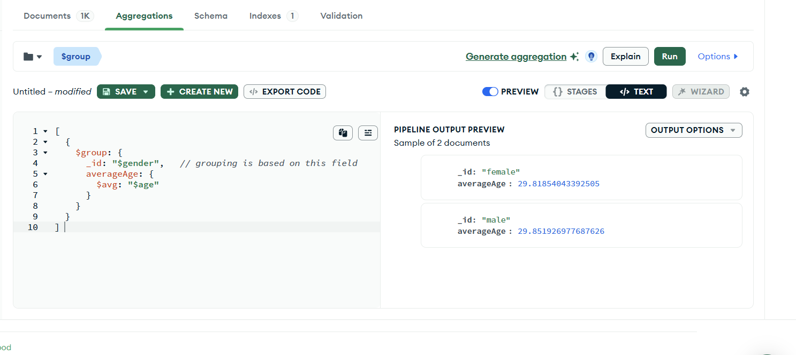
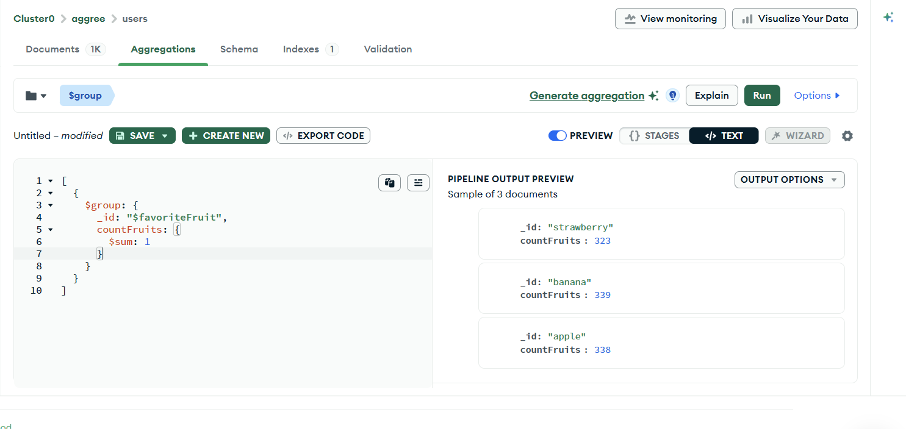
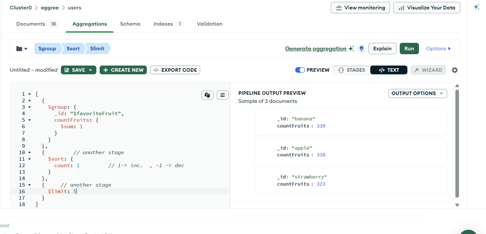

Now: 

## Q2: What is the avg. age of all Users ?

but before lets group the people based on gender : 



based on age :





```js
[
  {
    $group: {
      _id: null
    }
  }
] 
```

## => This is a MongoDB aggregation framework stage that groups all documents in a collection into a single document. By specifying _id: "$null", you instruct MongoDB to ignore specific field values and treat all incoming documents as part of a single, global group.

> so Everybody is in this document , now we can calculate the Average based on just one field which is Avg. 

Now :



```js
[
  {
    $group: {
      _id: null,
      averageAge: {
        $avg: "$age"
      }
    }
  }
] 
```
---



```js
[
  {
    $group: {
      _id: "$gender",   // grouping is based on this field
      averageAge: {
        $avg: "$age"
      }
    }
  } 
] 
```

---
---

## Q3. List the top 5 most common favorite among the users

In order find the common fruit , we have to group them together 



```js
[
  {
    $group: {
      _id: "$favoriteFruit",
      countFruits: {
        $sum: 1
      }
    }
  }
]
```

## Final Solution 3.



```js
[
  {
    $group: {
      _id: "$favoriteFruit",
      countFruits: {
        $sum: 1
      }
    }
  },
  {         // another stage
    $sort: {
      count: 1         // 1-> lowest value at top  , -1 -> higest value at top
    }
  },
  {     // another stage
    $limit: 5
  }
]
```

**__Without grouping , we cannot perform an operation to all the database users__**

---

# Explanation : 

---

You're very close. Just one small correction:

> "Without grouping, we cannot perform an operation on all database users."

That's **not entirely true**.

You **can** perform operations on all users without `$group`.

For example:

### Count all active users

```js
[
  {
    $match: {
      isActive: true
    }
  },
  {
    $count: "activeUsers"
  }
]
```

No `$group` used.

---

### Sort users by age

```js
[
  {
    $sort: {
      age: -1
    }
  }
]
```

Again, no grouping.

---

### Filter users

```js
[
  {
    $match: {
      age: { $gt: 25 }
    }
  }
]
```

No grouping.

---

## What `$group` actually does

`$group` is used when you want to **combine multiple documents into groups and perform aggregate calculations on each group**.

Think of it like:

```text
Many Documents
      ↓
Group them by some key
      ↓
Perform calculations on each group
```

---

## Example 1: Average age of all users

```js
[
  {
    $group: {
      _id: null,
      averageAge: {
        $avg: "$age"
      }
    }
  }
]
```

Suppose:

```js
[
  { age: 20 },
  { age: 30 },
  { age: 40 }
]
```

MongoDB creates one giant group:

```text
Group NULL
  ├── 20
  ├── 30
  └── 40
```

Then computes:

```text
(20 + 30 + 40) / 3 = 30
```

Output:

```js
{
  "_id": null,
  "averageAge": 30
}
```

---

## Example 2: Average age by gender

```js
[
  {
    $group: {
      _id: "$gender",
      averageAge: {
        $avg: "$age"
      }
    }
  }
]
```

Suppose:

```js
[
  { gender: "male", age: 20 },
  { gender: "male", age: 30 },
  { gender: "female", age: 25 },
  { gender: "female", age: 35 }
]
```

MongoDB internally creates:

```text
male
 ├── 20
 └── 30

female
 ├── 25
 └── 35
```

Output:

```js
[
  {
    "_id": "male",
    "averageAge": 25
  },
  {
    "_id": "female",
    "averageAge": 30
  }
]
```

---

## Example 3: Most common favorite fruit

Your pipeline is almost correct.

It should be:

```js
[
  {
    $group: {
      _id: "$favoriteFruit",
      countFruits: {
        $sum: 1
      }
    }
  },
  {
    $sort: {
      countFruits: -1
    }
  },
  {
    $limit: 5
  }
]
```

Notice:

```js
countFruits: -1
```

not

```js
count: -1
```

because the field created by `$group` is named `countFruits`.

---

## What `$sum: 1` means

Many beginners get confused here.

```js
{
  $sum: 1
}
```

means:

> "For every document in the group, add 1."

Example:

```text
apple
apple
apple
banana
banana
```

Grouping:

```text
apple group
  +1
  +1
  +1
 = 3

banana group
  +1
  +1
 = 2
```

Output:

```js
[
  {
    "_id": "apple",
    "countFruits": 3
  },
  {
    "_id": "banana",
    "countFruits": 2
  }
]
```

---

## The Most Important Idea

When you see:

```js
$group
```

ask yourself:

**"What is my grouping key?"**

That's whatever is inside `_id`.

Examples:

```js
_id: null
```

→ One giant group containing all documents.

```js
_id: "$gender"
```

→ One group per gender.

```js
_id: "$favoriteFruit"
```

→ One group per fruit.

```js
_id: "$country"
```

→ One group per country.

---

### Mental Model

Think of `$group` as the MongoDB equivalent of SQL's `GROUP BY`.

```sql
SELECT gender, AVG(age)
FROM users
GROUP BY gender;
```

MongoDB:

```js
[
  {
    $group: {
      _id: "$gender",
      averageAge: {
        $avg: "$age"
      }
    }
  }
]
```

If you understand **`_id` decides the groups** and operators like **`$avg`, `$sum`, `$max`, `$min`, `$push`** perform calculations on those groups, you've understood the core of `$group`. This is one of the most important aggregation stages and will show up a lot in backend interviews and real projects.
