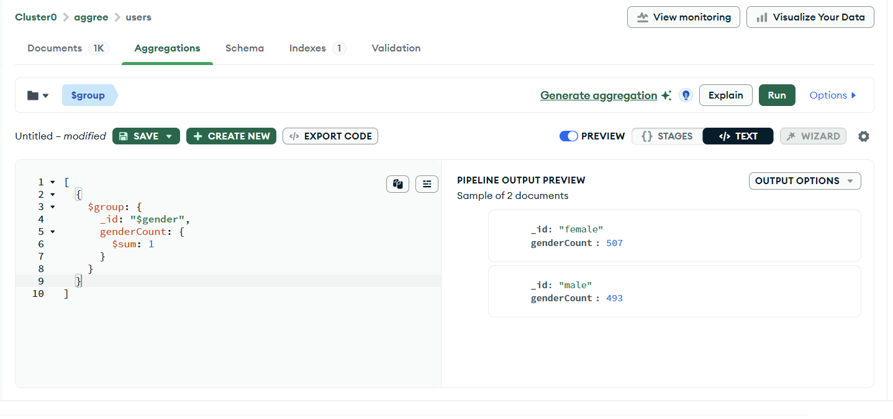
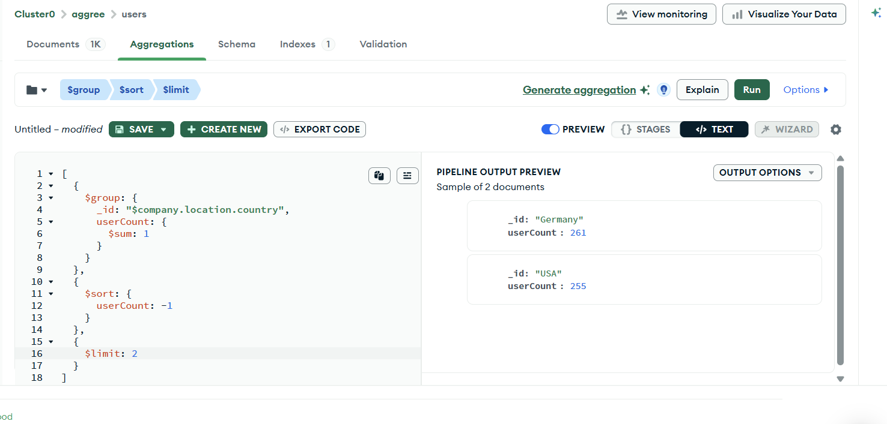
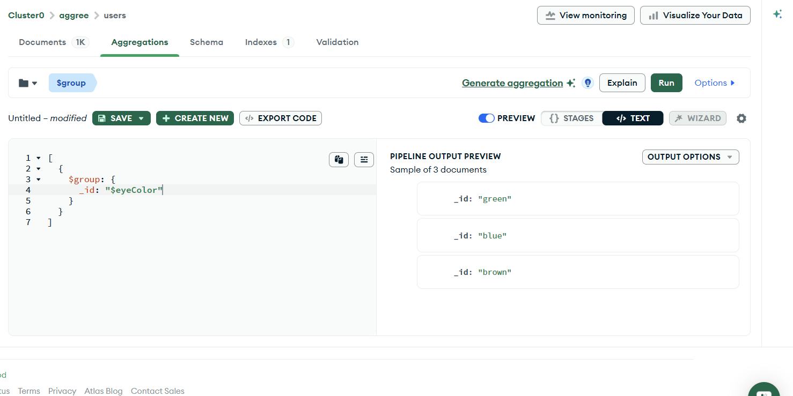
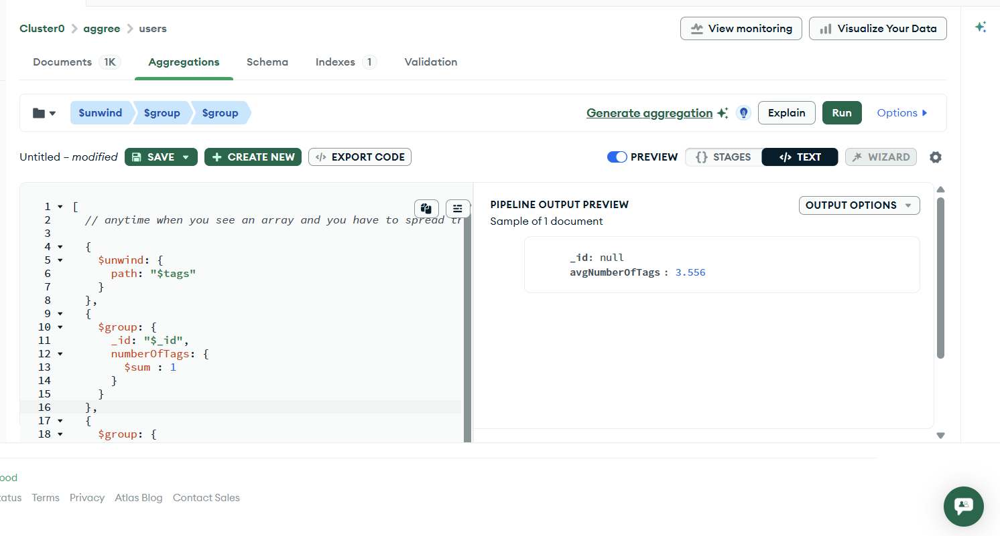
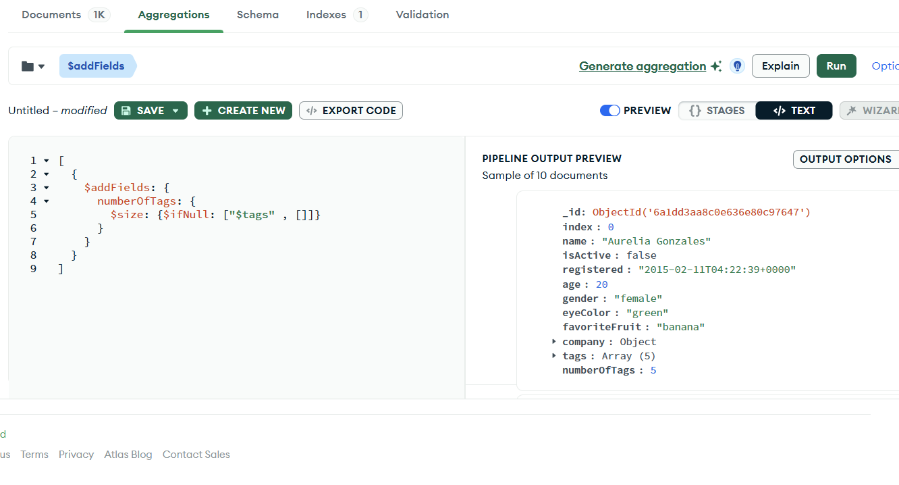
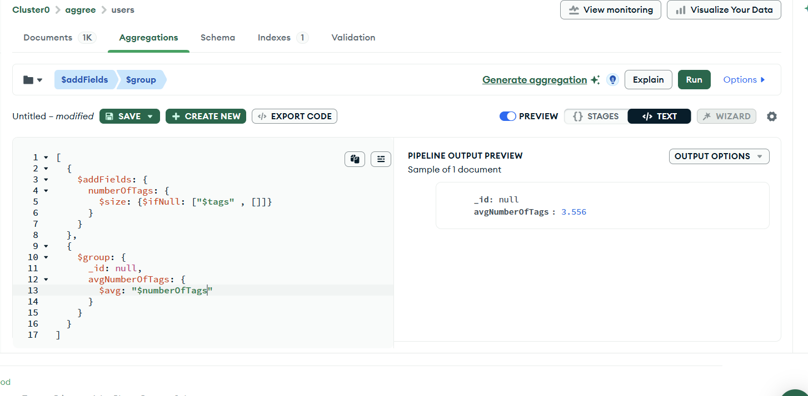

## Q4. List Total number of males and females

> Counting is done through the operation of `sum` not the `count` because it's being grouped altogether 



```js

[
  {
    $group: {
      _id: "$gender",
      genderCount: {
        $sum: 1
      }
    }
  }
]
```

## Q5. Which Country has the highest number of registered users ?

 

 ```js

 [
  {
    $group: {
      _id: "$company.location.country",
      userCount: {
        $sum: 1
      }
    }
  },
  {
    $sort: {
      userCount: -1
    }
  },
  {
    $limit: 2
  }
]
 ```

 ## Q6. List all unique eye colors in the collection 

 

```js

[
	{
	  $group: {
	    _id: "$eyeColor"
	  }
	}  
]
```

## Q7. What is the avg. number of tags per user ?



```js

[
  // anytime when you see an array and you have to spread them around , you must use $unWind

  {
    $unwind: {
      path: "$tags"
    }
  },
  {
    $group: {
      _id: "$_id",
      numberOfTags: {
        $sum : 1
      }
    }
  },
  {
    $group: {
      _id: null,
      avgNumberOfTags: {
        $avg: "$numberOfTags"
      }
    }
  }
]
```

 Another WAY : 

first we add a field "numberOfTags" to each document

 

 Then apply grouping : 

 

 ```js

 [
  {
    $addFields: {
      numberOfTags: {
        $size: {$ifNull: ["$tags" , []]}
      }
    }
  },
  {
    $group: {
      _id: null,
      avgNumberOfTags: {
        $avg: "$numberOfTags"
      }
    }
  }
]
 ```

---
---

# Explanation :

---
---

You're understanding the **most important idea of aggregation** now:

> **`$group` = Take multiple documents and combine them into groups, then perform calculations on each group.**

Let's go through each query carefully and understand **what every operator is doing**.

---

# Q4. Total number of males and females

```js
[
  {
    $group: {
      _id: "$gender",
      genderCount: {
        $sum: 1
      }
    }
  }
]
```

---

## Sample Data

```js
[
  { name: "A", gender: "male" },
  { name: "B", gender: "female" },
  { name: "C", gender: "male" },
  { name: "D", gender: "female" },
  { name: "E", gender: "male" }
]
```

---

## Stage 1: `$group`

```js
{
  $group: {
    _id: "$gender"
  }
}
```

MongoDB creates groups based on gender.

---

### Group 1

```js
male:
[
 A,
 C,
 E
]
```

### Group 2

```js
female:
[
 B,
 D
]
```

---

## `$sum: 1`

```js
genderCount: {
  $sum: 1
}
```

For every document inside the group:

```js
male:
1 + 1 + 1 = 3

female:
1 + 1 = 2
```

---

## Output

```js
[
  {
    _id: "male",
    genderCount: 3
  },
  {
    _id: "female",
    genderCount: 2
  }
]
```

---

# Q5. Which country has the highest number of users?

```js
[
  {
    $group: {
      _id: "$company.location.country",
      userCount: {
        $sum: 1
      }
    }
  },
  {
    $sort: {
      userCount: -1
    }
  },
  {
    $limit: 2
  }
]
```

---

## Step 1: `$group`

Suppose data is:

```js
[
 {country:"India"},
 {country:"India"},
 {country:"USA"},
 {country:"India"},
 {country:"Canada"},
 {country:"USA"}
]
```

Grouping:

```js
India   -> 3
USA     -> 2
Canada  -> 1
```

Result:

```js
[
  {
    _id: "India",
    userCount: 3
  },
  {
    _id: "USA",
    userCount: 2
  },
  {
    _id: "Canada",
    userCount: 1
  }
]
```

---

## Step 2: `$sort`

```js
{
  $sort: {
    userCount: -1
  }
}
```

### Meaning

Descending order.

Largest comes first.

```js
India  -> 3
USA    -> 2
Canada -> 1
```

---

### If it was

```js
{
  $sort:{
    userCount:1
  }
}
```

Then:

```js
Canada -> 1
USA    -> 2
India  -> 3
```

Ascending order.

---

## Step 3: `$limit`

```js
{
  $limit: 2
}
```

Keep only first 2 documents.

Output:

```js
[
  {
    _id: "India",
    userCount: 3
  },
  {
    _id: "USA",
    userCount: 2
  }
]
```

---

### Important Observation

Your question says:

> Which country has highest number of users?

Then technically:

```js
{
  $limit: 1
}
```

would be enough.

Using 2 gives top 2 countries.

---

# Q6. List all unique eye colors

```js
[
  {
    $group: {
      _id: "$eyeColor"
    }
  }
]
```

---

Suppose:

```js
[
 {eyeColor:"blue"},
 {eyeColor:"green"},
 {eyeColor:"blue"},
 {eyeColor:"brown"},
 {eyeColor:"green"}
]
```

---

Grouping:

```js
blue
green
brown
```

MongoDB creates one group per unique value.

---

Output:

```js
[
  {
    _id:"blue"
  },
  {
    _id:"green"
  },
  {
    _id:"brown"
  }
]
```

---

This works almost like SQL:

```sql
SELECT DISTINCT eyeColor
FROM users;
```

---

# Q7. Average number of tags per user

---

## Data

```js
{
  name:"Prashant",
  tags:["cpp","dsa","web"]
}
```

```js
{
  name:"Ravi",
  tags:["java","spring"]
}
```

```js
{
  name:"Amit",
  tags:["python"]
}
```

---

# Method 1 : Using `$unwind`

```js
[
  {
    $unwind: {
      path: "$tags"
    }
  }
]
```

---

## What does `$unwind` do?

It explodes an array.

Before:

```js
{
  tags:["cpp","dsa","web"]
}
```

After:

```js
{ tags:"cpp" }
{ tags:"dsa" }
{ tags:"web" }
```

One document becomes many documents.

---

### Entire dataset becomes

```js
{user1, tag:"cpp"}
{user1, tag:"dsa"}
{user1, tag:"web"}

{user2, tag:"java"}
{user2, tag:"spring"}

{user3, tag:"python"}
```

Total 6 documents now.

---

## Second Group

```js
{
  $group: {
    _id: "$_id",
    numberOfTags: {
      $sum: 1
    }
  }
}
```

Group again by user.

For user1:

```js
cpp
dsa
web
```

Count:

```js
1+1+1 = 3
```

For user2:

```js
1+1 = 2
```

For user3:

```js
1
```

Result:

```js
[
  { _id:user1, numberOfTags:3 },
  { _id:user2, numberOfTags:2 },
  { _id:user3, numberOfTags:1 }
]
```

---

## Third Group

```js
{
  $group: {
    _id: null,
    avgNumberOfTags: {
      $avg: "$numberOfTags"
    }
  }
}
```

All documents become one group.

Average:

```js
(3 + 2 + 1)/3
=
2
```

Output:

```js
[
  {
    _id:null,
    avgNumberOfTags:2
  }
]
```

---

# Method 2 (Better)

```js
[
  {
    $addFields: {
      numberOfTags: {
        $size: {
          $ifNull:["$tags", []]
        }
      }
    }
  },
  {
    $group: {
      _id:null,
      avgNumberOfTags:{
        $avg:"$numberOfTags"
      }
    }
  }
]
```

---

## `$ifNull`

```js
$ifNull:["$tags", []]
```

Meaning:

If tags exist:

```js
["cpp","dsa","web"]
```

use them.

Otherwise:

```js
[]
```

use empty array.

---

Example:

```js
{
  tags:null
}
```

becomes

```js
[]
```

This prevents errors.

---

## `$size`

```js
$size:["cpp","dsa","web"]
```

returns:

```js
3
```

---

## `$addFields`

Adds a new field.

Before:

```js
{
  tags:["cpp","dsa","web"]
}
```

After:

```js
{
  tags:["cpp","dsa","web"],
  numberOfTags:3
}
```

---

Dataset becomes:

```js
{
  numberOfTags:3
}
{
  numberOfTags:2
}
{
  numberOfTags:1
}
```

---

## Final `$group`

```js
{
  $group:{
    _id:null,
    avgNumberOfTags:{
      $avg:"$numberOfTags"
    }
  }
}
```

Computes:

```js
(3+2+1)/3
=
2
```

Output:

```js
[
  {
    _id:null,
    avgNumberOfTags:2
  }
]
```

---

# Operators Learned Today

| Operator     | Purpose                             |
| ------------ | ----------------------------------- |
| `$group`     | Create groups and aggregate data    |
| `$sum`       | Count or add values                 |
| `$avg`       | Calculate average                   |
| `$sort`      | Sort documents                      |
| `$limit`     | Keep first N documents              |
| `$unwind`    | Break array into multiple documents |
| `$addFields` | Add new fields                      |
| `$size`      | Length of array                     |
| `$ifNull`    | Replace null with default value     |

A useful mental model:

* **`$match`** → filter rows
* **`$group`** → combine rows
* **`$unwind`** → expand arrays
* **`$sort`** → order results
* **`$limit`** → take top N
* **`$project`** → choose which fields to return (you'll learn this next)

Once you're comfortable with these, you'll be ready for the aggregation pipelines used in the project-management backend you're currently studying.
