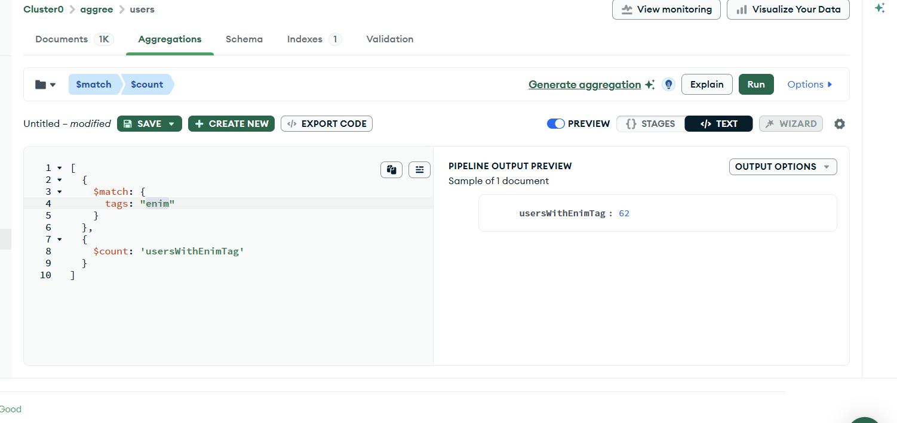
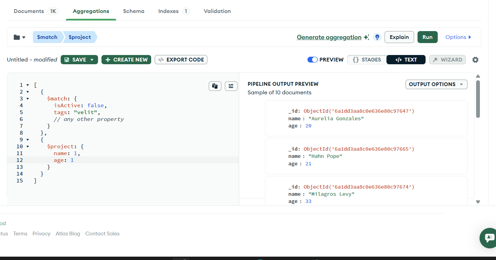
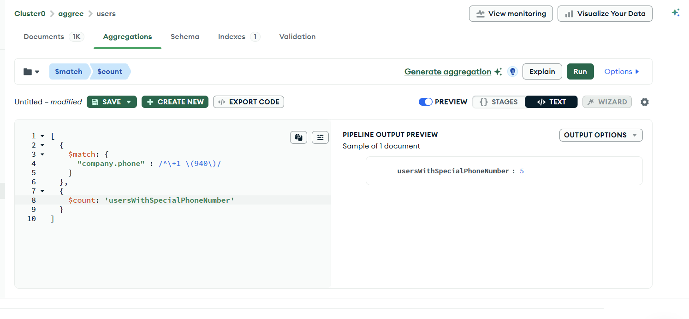

# Q. how many users have 'enim' as one of their tags ? 

The `$match` operator in MongoDB filters documents in an aggregation pipeline to allow only matching records to pass to the next stage. 



```js

[
  {
    $match: {
      tags: "enim"
    }
  },
  {
    $count: 'usersWithEnimTag'
  }
]
```

# Q. what are the names and age of users who are inactive and have 'velit' as a tag ?

`$project`
Passes along the documents with the requested fields to the next stage in the pipeline. The specified fields can be existing fields from the input documents or newly computed fields.




```js

[
  {
    $match: {
      isActive: false,
      tags: "velit",
      // any other property 
    }
  },
  {
    $project: {
      name: 1,
      age: 1
    }
  }
]
```

# Q. How many users have a phone number with '+1 (940)' ?



```js

[
  {
    $match: {
      "company.phone" : /^\+1 \(940\)/
    }
  },
  {
    $count: 'usersWithSpecialPhoneNumber'
  }
]
```