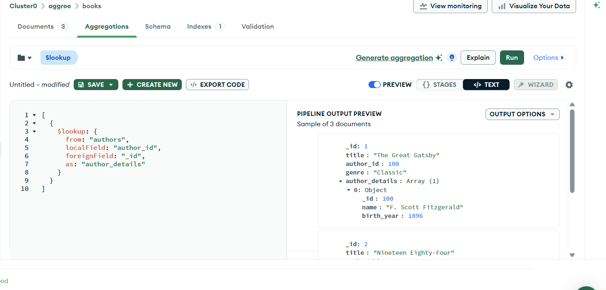
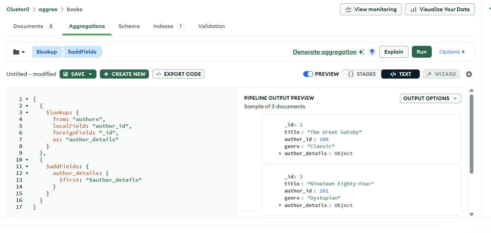
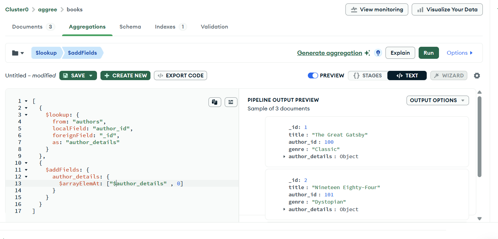

## These are similar to left joins 

*Performs a left outer join to a collection in the same database to filter in documents from the foreign collection for processing. The $lookup stage adds a new array field to each input document. The new array field contains the matching documents from the foreign collection. The $lookup stage passes these reshaped documents to the next stage.*

Terms : 

* `from` : from which collection i want to lookup the data

* `localField` : current field in the document we are present

* `foreignField` : field from other collection where localField matches

* `as` : what we want to call the result as

**__Example__** : 

consider `books` and `authors` collection : 

in books : 
     `author_id` is local field in books

in authors :
     `_id` is a foreign field for books 


---




```js

[
  {
    $lookup: {
      from: "authors",
      localField: "author_id",
      foreignField: "_id",
      as: "author_details"
    }
  }
]
```


---
---



```js

[
  {
    $lookup: {
      from: "authors",
      localField: "author_id",
      foreignField: "_id",
      as: "author_details"
    }
  },
  {
    $addFields: {
      author_details: {
        $first: "$author_details"
      }
    }
  }
]
```

Another way to do the same thing



```js

[
  {
    $lookup: {
      from: "authors",
      localField: "author_id",
      foreignField: "_id",
      as: "author_details"
    }
  },
  {
    $addFields: {
      author_details: {
        $arrayElemAt: ["$author_details" , 0]
      }
    }
  }
]
```