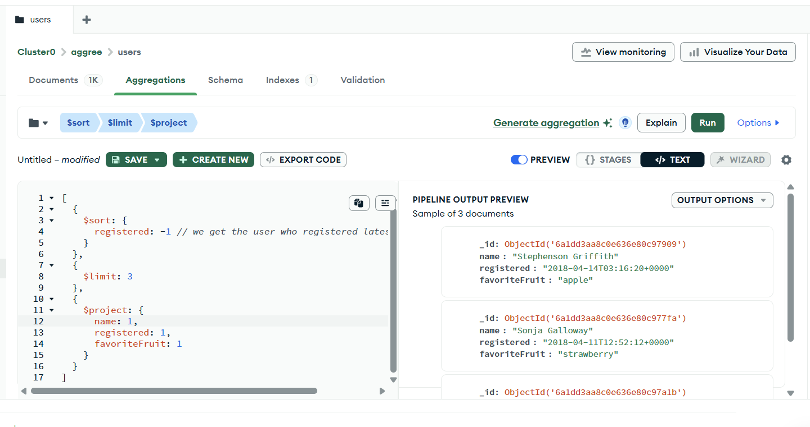
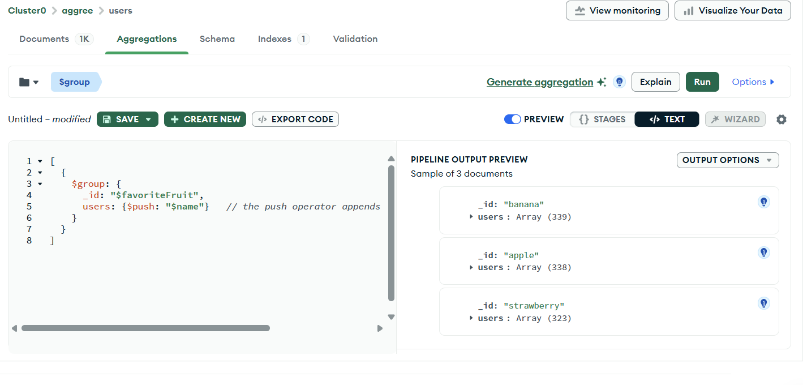
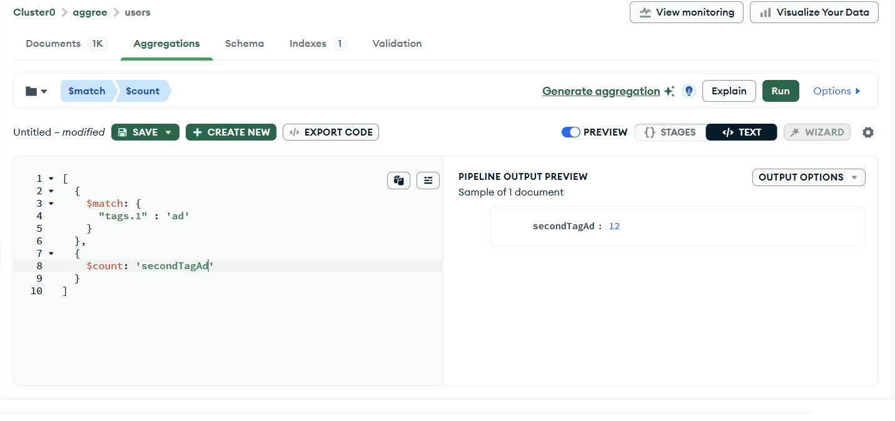
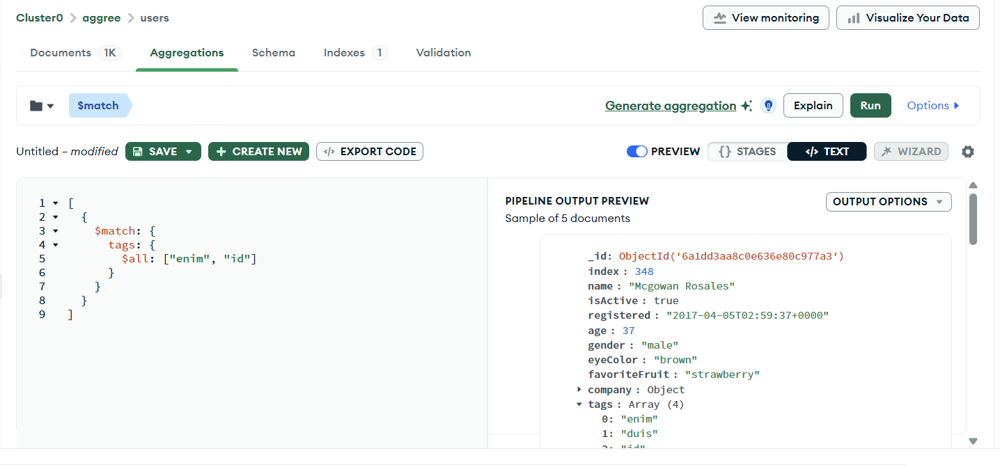
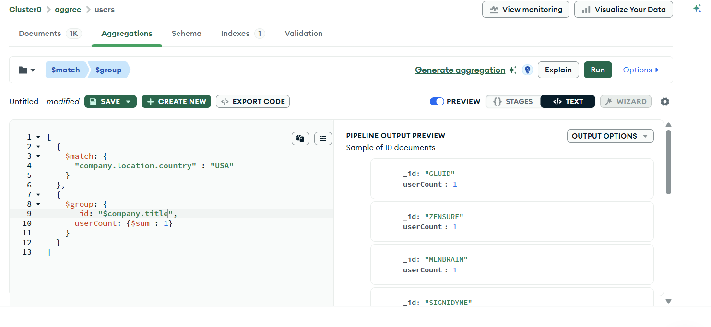

## Q. Who has registered the most recently ? 

 

```js
 [
  {
    $sort: {
      registered: -1 // we get the user who registered latest at the top 
    }
  },
  {
    $limit: 3
  },
  {
    $project: {
      name: 1,
      registered: 1,
      favoriteFruit: 1
    }
  }
]
```


## Q. Categorize Users by their favorite fruit



```js

[
  {
    $group: {
      _id: "$favoriteFruit",
      users: {$push: "$name"}   // the push operator appends a specified value to an array
    }
  }
]
```

## Q. How many users have 'ad' as the second tag in their list of tags ?

 

 ```js

 [
  {
    $match: {
      "tags.1" : 'ad'
    }
  },
  {
    $count: 'secondTagAd'
  }
]
 ```

 ## Q. Find users who have both 'enim' and 'id' as their tags

 the `$all` operator selects the documents where the value of a field is an array that contains all the specified elements  

 

 ```js

 [
  {
    $match: {
      tags: {
        $all: ["enim", "id"]
      }
    }
  }
]
 ```


## Q. List all the companies located in the USA with their corresponding user count.



```js

[
  {
    $match: {
      "company.location.country" : "USA"
    }
  },
  {
    $group: {
      _id: "$company.title",
      userCount: {$sum : 1}
    }
  }
]
```